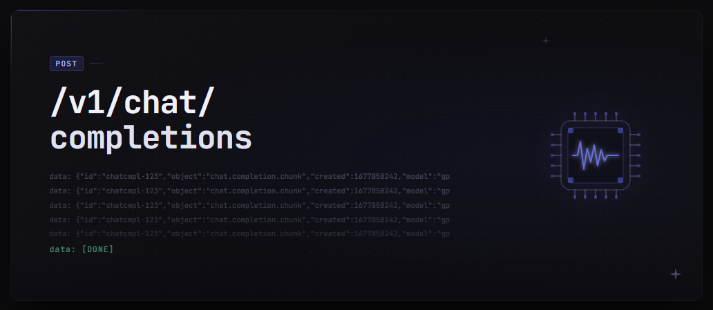

# InferenceX



[](https://www.python.org/downloads/)
[](https://docs.vllm.ai)
[](https://platform.openai.com/docs/api-reference)
[](https://docs.astral.sh/uv/)
[](./tests)
[](./LICENSE)

InferenceX is a self-hosted LLM inference platform built incrementally on top of vLLM.
It provides an OpenAI-compatible `POST /v1/chat/completions` endpoint, a model registry,
an observability pipeline, and an interactive Textual playground — all designed to run on
a single WSL2 machine with one consumer-grade GPU.

## Key docs

- `docs/ARCHITECTURE.md`
- `docs/PHASES.md`
- `docs/DECISIONS.md`
- `playground/README.md`
- `.cursor/rules/`

---

## Prerequisites

### WSL2 + Ubuntu

InferenceX runs on WSL2 Ubuntu (tested on Ubuntu 22.04). Enable WSL2 in Windows and
install Ubuntu from the Microsoft Store. The GPU must be accessible inside WSL2:

```bash
nvidia-smi   # should return GPU info; if not, update your NVIDIA Windows driver
```

### CUDA Toolkit

vLLM requires CUDA. The recommended approach is to use the bundled CUDA wheels installed
by `uv sync`. If you need a system-level CUDA toolkit (e.g. for FlashInfer JIT), install
CUDA 12.x:

```bash
wget https://developer.download.nvidia.com/compute/cuda/repos/ubuntu2204/x86_64/cuda-keyring_1.1-1_all.deb
sudo dpkg -i cuda-keyring_1.1-1_all.deb
sudo apt-get update && sudo apt-get install -y cuda-toolkit-12-4
```

Then export `CUDA_HOME=/usr/local/cuda` in your shell profile.

> **WSL2 note:** FlashInfer JIT often fails on WSL2 due to missing system nvcc. InferenceX
> automatically sets `VLLM_USE_FLASHINFER_SAMPLER=0` on WSL2 to avoid this.

### uv

InferenceX uses [uv](https://docs.astral.sh/uv/) for dependency management:

```bash
curl -LsSf https://astral.sh/uv/install.sh | sh
```

---

## Installation

```bash
# Clone the repository
git clone https://github.com/coeusyk/inference-x.git
cd inference-x

# Install all dependencies (creates .venv automatically)
uv sync

# Verify unit tests pass (no GPU required)
uv run pytest tests/unit -q
```

> **Important:** Always use `uv run` to invoke scripts and tools. Bare `python` or
> `uvicorn` from your shell PATH will bypass `.venv` and vllm will appear missing.

---

## Pre-downloading models

Models are downloaded from HuggingFace on first use. Pre-downloading avoids a silent
stall during server startup:

```bash
# Using huggingface-cli (recommended)
uv run huggingface-cli download Qwen/Qwen2.5-0.5B-Instruct
uv run huggingface-cli download TinyLlama/TinyLlama-1.1B-Chat-v1.0
uv run huggingface-cli download facebook/opt-125m

# Or using the Python API
uv run python -c "
from huggingface_hub import snapshot_download
snapshot_download('Qwen/Qwen2.5-0.5B-Instruct')
snapshot_download('TinyLlama/TinyLlama-1.1B-Chat-v1.0')
"
```

For gated models (e.g. `llama3-8b` in `config/models.yaml`):

1. Request access on the [model page](https://huggingface.co/meta-llama/Meta-Llama-3-8B-Instruct) and wait for approval.
2. Authenticate locally:

```bash
uv run huggingface-cli login
# or: export HF_TOKEN=hf_...   (see .env.example)

uv run huggingface-cli download meta-llama/Meta-Llama-3-8B-Instruct
INFERENCE_X_DEFAULT_MODEL=llama3-8b ./scripts/dev.sh serve
```

Without a token, startup fails immediately with a short message instead of a HuggingFace stack trace. If you have a token but access is not yet approved, startup fails with a separate message pointing you to the model page — no multi-minute vLLM stack trace.

---

## Quick start

### Interactive use (server starts after model pick)

`make chat` and `make playground` launch the TUI first. After you choose model(s), the
server starts automatically with `INFERENCE_X_LOADED_MODELS` set to your selection
(one model for chat, two for compare).
You do **not** need to run `scripts/dev.sh serve` first.

```bash
# Daily-driver: multi-turn chat CLI
make chat
```

```bash
# Compare two models side-by-side
make playground

# Pre-selected compare pair (skips the two-model picker)
make playground-compare MODEL_A=qwen2.5-0.5b MODEL_B=tinyllama-chat
```

While the model loads, a loading screen shows startup phases, step progress, and a
live tail of `logs/playground-server.log`. On failure, the banner and log feed show an
actionable error summary (e.g. insufficient VRAM) parsed from the server log — not a
generic fallback. Server logs also go to:

```bash
tail -f logs/playground-server.log
```

### Server-only / API / benchmarks

Use `scripts/dev.sh serve` when you want a headless API server only. This is **required**
before running benchmarks (`make benchmark`, `make benchmark-all`, `make advise`) or
direct API calls from a second terminal.

```bash
# Terminal 1 — start server only (required for benchmarks and direct API access)
INFERENCE_X_DEFAULT_MODEL=qwen2.5-0.5b ./scripts/dev.sh serve
```

```bash
# Terminal 2 — API smoke test
curl -s http://localhost:8000/health
curl -s http://localhost:8000/v1/models
curl -s -X POST http://localhost:8000/v1/chat/completions \
  -H "Content-Type: application/json" \
  -d '{"model":"qwen2.5-0.5b","messages":[{"role":"user","content":"Hello"}]}'
```

```bash
# Benchmarks (server must already be running)
make benchmark MODEL=qwen2.5-0.5b
make benchmark-all
make advise
```

To load multiple models for compare mode or benchmarks across models:

```bash
INFERENCE_X_LOADED_MODELS=qwen2.5-0.5b,tinyllama-chat ./scripts/dev.sh serve
```

The `INFERENCE_X_LOADED_MODELS` environment variable accepts a comma-separated list of
model names from `config/models.yaml`. All listed models are loaded at startup and served
simultaneously. VRAM is split automatically between them.

---

## Commands

Run `make help` for a full list of make targets.

**Interactive (self-contained — no manual server start):**

| Command | Description |
|---------|-------------|
| `make chat` | Start server + Claude-style multi-turn chat CLI (single model) |
| `make playground` | Compare two models side-by-side (interactive TUI) |
| `make playground-compare MODEL_A=… MODEL_B=…` | Compare with preset models (skips picker) |
| `make stop` | Stop background uvicorn and vLLM worker processes |

**Server / API / benchmarks (start `scripts/dev.sh serve` first):**

| Command | Description |
|---------|-------------|
| `make benchmark MODEL=<name>` | Run standard prompt suite for one model |
| `make benchmark-all` | Benchmark qwen2.5-0.5b + tinyllama-chat |
| `make advise` | Print ranked model advisor report |
| `make client` | Batch CLI runner (rich terminal output) |

---

## Configuration reference

Copy `.env.example` to `.env` at the repo root — both `./scripts/dev.sh serve` and the Python app load it automatically (shell variables already exported take precedence).

| File | Purpose |
|------|---------|
| `config/models.yaml` | Model registry — name, model_path, gpu_memory_utilization, max_model_len |
| `config/routing.yaml` | Routing policy — default_model, fallback chain |
| `config/server.yaml` | Server defaults — host (127.0.0.1), port (8000) |
| `config/logging.yaml` | Logging config — rotating file handler + console |

Key environment variables:

| Variable | Default | Description |
|----------|---------|-------------|
| `INFERENCE_X_DEFAULT_MODEL` | `qwen2.5-0.5b` | Model to load when LOADED_MODELS is unset |
| `INFERENCE_X_LOADED_MODELS` | (default model) | Comma-separated list of models to load at startup |
| `INFERENCE_X_CONFIG_DIR` | `config` | Path to config directory |
| `INFERENCE_X_METRICS_FILE` | (unset) | If set, enables NDJSON metrics export to this path |
| `INFERENCE_X_STREAM_TIMEOUT_S` | `120` | Per-token SSE timeout in seconds (0 = disabled) |

---

## Benchmark suite

The benchmark runner measures throughput (tokens/sec), time-to-first-token (TTFT),
latency percentiles (p50/p95/p99), and **VRAM footprint** per model (`peak_vram_delta_gb`:
total GPU memory minus the minimum free VRAM observed before and after the run). This
works when the model is already loaded on the server — the common workflow. Each result
JSON also stores a `hardware` snapshot (GPU name, VRAM total/free, CPU, RAM) from run time.

The model advisor ranks results against your **current** hardware profile. It skips
results whose saved `hardware` does not match the current GPU (with a warning) and emits
a soft warning for legacy results that lack a `hardware` field — re-run
`make benchmark MODEL=…` to refresh them.

**Prerequisites:** a running server with the target model loaded. Start the server
separately via `./scripts/dev.sh serve` (or restart with `make stop` then serve again).
`make chat` / `make playground` start their own background server but are not used for
the benchmark CLI workflow below.

```bash
# Terminal 1 — server must be running (not started by make benchmark)
INFERENCE_X_DEFAULT_MODEL=qwen2.5-0.5b ./scripts/dev.sh serve

# Terminal 2
make benchmark MODEL=qwen2.5-0.5b    # writes docs/benchmarks/results-<model>-<timestamp>.json
make benchmark-all                   # benchmarks qwen2.5-0.5b and tinyllama-chat
make advise                          # ranked table + WARNING lines for skipped/legacy results
```

Optional hardware profiling deps (improves VRAM accuracy on WSL2):

```bash
uv sync --extra hardware   # installs nvidia-ml-py + psutil
```

**API endpoints** (read-only, return empty lists when no results exist yet):

| Endpoint | Description |
|----------|-------------|
| `GET /v1/benchmark/results` | Stored benchmark results + current hardware profile |
| `GET /v1/benchmark/advise` | Ranked advisor output, current hardware, and `warnings` |

Benchmarks run from the CLI (`make benchmark`, `make advise`) or API — not from the
compare playground TUI. Use `make chat` for daily single-model chat and `make playground`
for side-by-side model comparison.

**Prompt suite:** `benchmarks/prompts/standard.json` — 10 fixed prompts (factual,
generation, code, reasoning, chat). Results are comparable across runs via
`suite_version` (SHA256 of the prompt list).

---

## Troubleshooting

### First-load stall

**Symptom:** Server appears to hang after printing `Using FlashAttention version 2`.

**Cause:** HuggingFace is downloading the model weights in the background with no
progress indicator (~2–7 GB depending on model). This is normal.

**Fix:** Pre-download the model weights before starting the server (see above). You can
watch the HuggingFace cache directory to see download progress:

```bash
watch -n 2 "du -sh ~/.cache/huggingface/hub/"
```

If the server was interrupted mid-download, clear the incomplete cache entry:

```bash
rm -rf ~/.cache/huggingface/hub/models--<org>--<model>
```

### CUDA not found

**Symptom:** `RuntimeError: vLLM FlashInfer JIT requires nvcc` or
`CUDA_HOME not set and nvcc not found`.

**Fix 1 (recommended):** Always start the server via `uv run` or `./scripts/dev.sh serve`.
The bundled `nvidia-cuda-nvcc` wheel provides nvcc in `.venv`.

**Fix 2:** Set `CUDA_HOME` to your CUDA toolkit root:

```bash
export CUDA_HOME=/usr/local/cuda
export PATH=$CUDA_HOME/bin:$PATH
```

**Fix 3 (WSL2-specific):** InferenceX automatically disables FlashInfer on WSL2
(`VLLM_USE_FLASHINFER_SAMPLER=0`). If you see this error anyway, run:

```bash
export VLLM_USE_FLASHINFER_SAMPLER=0
./scripts/dev.sh serve
```

### Gated model access denied (Llama 3)

**Symptom:** Server exits on startup with `gated on HuggingFace`, `not yet approved`, or `403 Forbidden` for `meta-llama/...`.

**Fix:**

1. Open https://huggingface.co/meta-llama/Meta-Llama-3-8B-Instruct and request access (Meta license).
2. Wait for approval email from HuggingFace (a token alone is not enough until access is granted).
3. After approval: `uv run huggingface-cli login`
4. Retry: `INFERENCE_X_DEFAULT_MODEL=llama3-8b ./scripts/dev.sh serve`

If you do not have access yet, use an ungated model instead:

```bash
INFERENCE_X_DEFAULT_MODEL=qwen2.5-0.5b ./scripts/dev.sh serve
```

### GPU memory insufficient (Llama 3 on 8 GiB)

**Symptom:** Startup fails with `Free memory on device cuda:0 ... less than desired GPU memory utilization` or `Insufficient GPU memory to start llama3-8b`.

**Fix:**

1. Stop other GPU processes (`make stop`, or kill leftover `uvicorn` / vLLM workers).
2. Lower `gpu_memory_utilization` for `llama3-8b` in `config/models.yaml` (default is now `0.85` for 8 GiB WSL2 GPUs).
3. If startup still fails after passing the memory check, the 8B bf16 model likely needs **16 GiB+ VRAM** — use `qwen2.5-1.5b` or a quantized Llama checkpoint instead.

### Port already in use

**Symptom:** `OSError: [Errno 98] Address already in use` on port 8000.

**Fix:** Find and kill the existing process:

```bash
make stop
# or manually:
lsof -ti:8000 | xargs kill -9
```

A previous `make playground` may have left a background uvicorn process running.
Always run `make stop` before restarting.

### Two servers on one GPU (KV cache error)

**Symptom:** Second server fails with
`Available KV cache memory: -0.04 GiB` or similar negative cache error.

**Fix:** Only one vLLM server per GPU. Kill all existing processes first:

```bash
pkill -f "uvicorn inference_x"
pkill -f "VLLM::EngineCore"
```

---

## Development environment

- Windows host with WSL2 Ubuntu as the primary runtime
- Cursor as the editor (with agent-assisted development via `.cursor/rules/`)
- Python 3.13+ managed by uv
- vLLM for inference (must be run with `uv run`)
