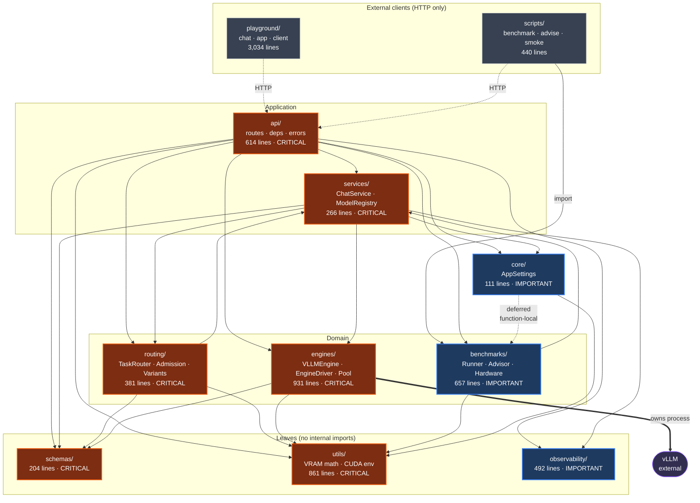
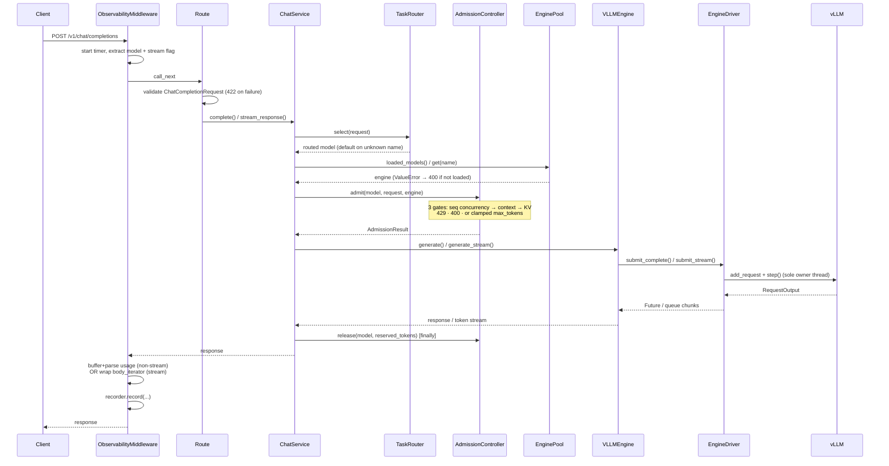

# Understanding Inference-X

**Status of this document:** a reverse-engineered description of what exists in this
repository as of commit `90350d9` (branch `develop`). Every claim below was verified
against source files, not against design documents. Where the repository's own docs
describe intent that the code does not implement, the code wins and the discrepancy is
called out explicitly.

**Method and evidence rules.** Module inventory and the dependency graph were derived by
parsing every `.py` file under `src/`, `playground/`, `scripts/`, and `tests/` with
Python's `ast` module. The Graphify knowledge graph in `graphify-out/` was used only to
decide reading order; no architectural claim here rests on graph connectivity. (That
graph reported 524 dangling and 134 collapsed edges, so its connectivity is not a
reliable source.)

**Feature-status discriminator** used in every table below:

| Status | Rule |
|---|---|
| **Implemented** | Code path exists and at least one test exercises it. |
| **Partial** | Code exists, but a documented parameter, branch, or guarantee is not honored end to end. |
| **Experimental** | Reachable only behind an environment toggle, or explicitly self-described as a placeholder. |
| **Planned** | A spec or phase document describes it; no implementing code exists. |
| **Not implemented** | No code and no active spec. |

---

## 1. What Inference-X is

Inference-X is a **self-hosted, single-process LLM inference server** that wraps vLLM
behind an OpenAI-compatible HTTP API, plus a set of local tools for benchmarking,
comparing, and chatting with the models it serves.

Concretely, the repository produces:

1. **A FastAPI application** (`inference_x.api.main:app`) serving six HTTP endpoints,
   backed by one or more in-process vLLM engines.
2. **A benchmark and advisor subsystem** that measures models over HTTP and ranks them
   against the machine's detected hardware.
3. **Three terminal client programs** under `playground/` — a chat TUI, a side-by-side
   compare TUI, and a batch CLI — which talk to the server purely over HTTP.

Package metadata (`pyproject.toml`): name `inferencex`, version `0.1.0`, requires
Python `>=3.13`, built with hatchling from `src/inference_x`. Licensed MIT
(© 2026 Yash Karecha).

Approximate size: **14,616 lines of Python** across `src/` (51 files), `tests/`
(38 test files, 430 collected tests), `playground/` (14 modules), and `scripts/`
(6 scripts).

## 2. Why it exists

The repository states its purpose directly and the code corroborates it. From
`pyproject.toml`: *"Self-hosted LLM inference platform with smart routing and
observability."* From `docs/ARCHITECTURE.md`, the stated goals are to keep the external
API stable while internals evolve, add capabilities by adding modules rather than
replacing them, keep behavior configuration-driven, keep logic out of route handlers,
and make each phase independently runnable.

What the code shows beyond the stated goals: an unusual proportion of the codebase is
devoted to **making vLLM survive on a small consumer GPU**. `utils/vllm_pool_config.py`
(558 lines) exists solely to compute VRAM budgets before a model loads;
`config/vram_tiers.yaml` encodes per-GPU-class safety envelopes; `routing/admission.py`
rejects or clamps requests that would exceed the KV cache; `utils/vllm_platform_patch.py`
patches vLLM for WSL2. The inline comment in `config/models.yaml` names the development
machine: an 8 GiB WSL2 environment. `config/vram_tiers.yaml` names it again — "RTX 3060
Laptop 6GB, the box this repo is developed on."

So the operative motivation, as evidenced by where the code volume went, is: run vLLM
reliably on hardware that is too small for it by default, and make that failure mode
legible instead of an opaque CUDA OOM.

## 3. Who it is built for

Verifiable from `SECURITY.md`, `CONTRIBUTING.md`, and the default bind address:

- **A single local developer or researcher** running models on their own workstation.
  `SECURITY.md`: *"designed for local deployment only — it binds to `127.0.0.1` by
  default and has no authentication. It is not hardened for public internet exposure."*
- **Consumer NVIDIA GPU owners**, specifically 6–24 GiB cards — the three tiers defined
  in `config/vram_tiers.yaml`.
- **WSL2 users on Windows.** `scripts/dev.sh`, `utils/cuda_env.py`, and
  `utils/vllm_platform_patch.py` all contain WSL2-specific handling.

It is explicitly **not** built for multi-tenant or production-internet use.
`CONTRIBUTING.md` lists authentication/multi-user support (`DEC-DEFER-01`) and rate
limiting (`DEC-DEFER-02`) under "What does not fit."

## 4. Problems it solves

Each item below maps to code that exists:

| Problem | Where it is solved |
|---|---|
| vLLM OOMs or fails to allocate a KV cache on a small GPU | `utils/vllm_pool_config.py` pre-computes weights + KV + overhead and sizes `gpu_memory_utilization` before load |
| vLLM's failure messages are opaque | `engines/vllm_engine.py::_map_vllm_init_error` translates 9 distinct failure signatures into actionable messages |
| A long prompt silently truncates or crashes the engine | `routing/admission.py` gates on context length pre-dispatch |
| Concurrent requests overrun the KV pool | `routing/admission.py` tracks reserved tokens per model; returns 429 or clamps |
| Non-streaming concurrent requests lost output | `engines/driver.py` — one owning thread per engine demultiplexes `step()` |
| Which model should I run on this GPU? | `benchmarks/` + `scripts/advise.py` rank measured results against detected hardware |
| Gated HuggingFace repos fail late, after a long download | `engines/vllm_engine.py::preflight_hf_access` probes access before weights download |
| Same logical model at several precisions | `routing/variant_selector.py` picks the highest precision that fits |

## 5. Overall architecture

A single Python process hosts the HTTP server and every vLLM engine. There is no broker,
no worker fleet, and no external datastore.

```
HTTP client (playground / curl / benchmark runner)
        │
        ▼
FastAPI app  (api/main.py)
  ├── ObservabilityMiddleware  (wraps every request)
  └── routers: /health, /v1/chat/completions, /v1/models,
               /v1/metrics, /v1/benchmark/*
        │
        ▼
api/deps.py   ← process-wide singletons, all @lru_cache(maxsize=1)
        │
        ▼
ChatService (services/chat_service.py)
        │
        ├─► TaskRouter (routing/) ......... which model name?
        ├─► AdmissionController (routing/) . may this request run, and how big?
        └─► EnginePool (engines/) ......... which engine object?
                    │
                    ▼
              VLLMEngine (engines/vllm_engine.py)
                    │
                    ▼
              EngineDriver (engines/driver.py)  ← one owning thread
                    │
                    ▼
              vLLM LLMEngine (external)
```

**Layering (verified by import analysis).** Package-level import edges:

```
api          → benchmarks, core, engines, observability, routing, schemas, services, utils
services     → core, engines, observability, routing, schemas
routing      → schemas, services, utils
engines      → schemas, utils
benchmarks   → services, utils
core         → benchmarks (deferred), utils
observability→ (no internal imports)
schemas      → (no internal imports)
utils        → (no internal imports)
```

`schemas`, `utils`, and `observability` are leaves — nothing internal is imported by them.
`api` is the only package importing every other layer.

**Two package-level cycles exist, and neither is a real module-level import cycle:**

- `routing ↔ services`: `routing/admission.py` imports `services.model_service`;
  `services/chat_service.py` imports `routing.admission`. `services/model_service.py`
  imports nothing from `routing`, so no module ever imports itself transitively.
- `core → benchmarks → services → core`: broken deliberately.
  `core/settings.py` imports `benchmarks.hardware` **inside** `get_vram_tier()`, with the
  comment *"Import is local to avoid pulling benchmarks.hardware into every settings
  consumer."*

**Singleton lifecycle.** `api/deps.py` builds the registry, router, engine pool,
admission controller, and metrics recorder as `@lru_cache(maxsize=1)` functions.
`initialize_app()` runs them eagerly in the FastAPI `lifespan` startup so the process
fails fast rather than failing on first request; `shutdown_app()` shuts down the pool and
clears every cache.

## 6. Request lifecycle

Tracing `POST /v1/chat/completions` through the source:

1. **ASGI entry.** `ObservabilityMiddleware.dispatch` (`observability/middleware.py`)
   starts a `perf_counter`, and for this path reads and caches the request body to
   extract `model` and `stream`.
2. **Validation.** FastAPI validates the body against `ChatCompletionRequest`
   (`schemas/chat.py`). Constraints: 1–50 messages, content ≤ 32,000 chars,
   `temperature` 0–2, `max_tokens` 1–4096, `top_p` 0–1. A violation returns 422 before
   any application code runs.
3. **Dependency resolution.** `get_chat_service` assembles a `ChatService` from the four
   cached singletons. Nothing is constructed per request except the `ChatService` wrapper.
4. **Routing.** `TaskRouter.select()` applies `ExplicitModelPolicy` — return
   `request.model` if it is registered — then falls back to `DefaultModelPolicy`.
   **A model name that is not registered does not error; it is silently served by the
   default model.** This is deliberate and tested
   (`tests/unit/test_router.py::test_falls_back_to_default_for_unknown_model`).
   Note: `ExplicitModelPolicy`'s class docstring says *"Raises ValueError if the model is
   not in the registry"* — the implementation returns `None` instead. The docstring is
   stale; the fallback is the real behavior.
5. **Pool check.** `ChatService._resolve_engine` verifies the routed model is actually
   loaded. If routed but not loaded, it raises `ValueError` naming the fix
   (`INFERENCE_X_LOADED_MODELS=...`) → 400.
6. **Admission.** `AdmissionController.admit()` runs three gates in order:
   a. *Sequence concurrency* — in-flight count vs. resolved `max_num_seqs`. No clamp
      path; exceeding it raises `EngineSaturatedError` → **429 with `Retry-After`**.
   b. *Context length* — `prompt_tokens + requested_output` vs. the minimum of the
      model's `max_model_len`, the tier's `max_model_len_cap`, and the request's own
      `max_context_tokens`. Prompt tokens come from the engine's real tokenizer when
      available, else `chars/4`. Overflow either clamps output (interactive priority) or
      raises `ContextTooLongError` → 400 (batch priority, or < 16 tokens of room).
    c. *KV pressure* — reserved tokens vs. `kv_capacity_tokens × 0.9`. Interactive
      clamps; batch gets 429.
   Each gate **fails open** when its input is unavailable (no tier, no tokenizer, no
   reported KV capacity).
7. **Dispatch.** `max_tokens` is overwritten with the admitted value via
   `request.model_copy(update=...)`, then `engine.generate()` or
   `engine.generate_stream()` runs.
8. **Engine.** `VLLMEngine` builds `SamplingParams`, renders the prompt (the model's own
   chat template when it has one, else a `System:/User:/Assistant:` concatenation), and
   submits to `EngineDriver`. The driver's single owning thread is the only caller of
   `add_request`/`step()` for that engine and demultiplexes outputs by `request_id`.
9. **Release.** A `finally` block calls `admission.release()` with the same
   `reserved_tokens`, for both success and failure.
10. **Response.**
    - *Non-streaming:* middleware buffers the body once, parses `usage`, and re-wraps it
      in an identical `Response` (minus `content-length`, which is recomputed).
    - *Streaming:* the body is **not** buffered. `_wrap_and_record_sse` passes chunks
      through untouched while measuring TTFT and counting whitespace-delimited words as
      an approximate token count, recording exactly one `RequestRecord` at stream end.
11. **Recording.** `MetricsRecorder.record()` writes to a capped in-memory ring buffer
    (1,000 records) and to the configured exporter. Both are wrapped in try/except —
    an observability failure can never break a request.

**Error mapping** (`api/errors.py`):

| Exception | HTTP | Body |
|---|---|---|
| `ValueError` (incl. `ContextTooLongError`) | 400 | Sanitized: `"Request could not be processed."` |
| `RuntimeError` | 500 | Sanitized: `"Request could not be processed."` |
| `EngineSaturatedError` | 429 + `Retry-After` | **Not** sanitized — the real message is returned |

The sanitization is deliberate: 400/500 bodies never leak internals; the 429 message
names no internals and telling the client to retry is the point.

## 7. Internal modules

### `api/` — HTTP surface and composition root

- **Responsibility:** define endpoints, wire singletons, translate exceptions to HTTP.
- **Inputs:** HTTP requests; `AppSettings`.
- **Outputs:** JSON / SSE responses.
- **Depends on:** every other package.
- **Why it exists:** keeps FastAPI-specific concerns in one place; `docs/ARCHITECTURE.md`
  requires route handlers to hold no business logic, and they do not — the longest
  handler body is ~12 lines.
- **Files:** `main.py` (79), `deps.py` (278), `errors.py` (53), `routes/` (5 files, 204).

`main.py` does three things before importing anything else: `ensure_vllm_process_env()`
and `apply_vllm_platform_patch()` run at import time, **before** any module can import
vLLM, because vLLM reads its environment at import.

### `core/` — settings

- **Responsibility:** read environment variables and YAML into an `AppSettings` object;
  resolve the VRAM tier.
- **Files:** `settings.py` (111). **`core/lifecycle.py` and `core/logging.py` exist but
  are empty (0 bytes).** Logging is actually configured in `api/main.py::_configure_logging`
  and lifecycle in `api/main.py::lifespan` + `api/deps.py`.
- `load_project_env()` loads a repo-root `.env` at import time with `override=False`, so
  already-exported shell variables win.

### `schemas/` — wire contracts

- **Responsibility:** Pydantic models for every request and response.
- **Depends on:** nothing internal (leaf).
- **Files:** `chat.py` (67), `model.py` (78), `metrics.py` (46), `common.py` (13).
- Notable: `ModelObject` **extends** the OpenAI `/v1/models` schema additively with
  `quantization`, `max_model_len`, and `estimated_weights_gib`.

### `services/` — orchestration

- **Responsibility:** coordinate router + admission + pool; own no I/O.
- **Files:** `chat_service.py` (135), `model_service.py` (74), `metrics_service.py` (57).
- `ModelRegistry` is the single source of truth for declared models. It does **not** own
  engines — `variants(family)` treats an entry with no `family` as its own family of one,
  which is what makes variant selection safe for ungrouped models.

### `engines/` — inference backends

- **Responsibility:** implement `BaseEngine`; own the vLLM process interaction.
- **Files:** `base.py` (26), `vllm_engine.py` (616), `driver.py` (226), `pool.py` (63).
  **`engines/registry.py` exists but is empty (0 bytes)** — there is no engine registry;
  `api/deps.py` constructs `VLLMEngine` directly.

### `routing/` — model selection and admission

- **Files:** `task_router.py` (27), `policies.py` (41), `admission.py` (234),
  `variant_selector.py` (79).
- `admission.py`'s module docstring is the most precise specification of admission
  behavior in the repository and matches the implementation.

### `observability/` — metrics capture

- **Responsibility:** record one `RequestRecord` per request; never affect the response.
- **Depends on:** nothing internal (leaf).
- **Files:** `middleware.py` (285), `recorder.py` (85), `storage.py` (64),
  `exporters.py` (58).
- Storage is a `deque(maxlen=1000)` behind a lock. **Metrics do not survive a restart.**

### `benchmarks/` — measurement and ranking

- **Files:** `runner.py` (195), `advisor.py` (187), `hardware.py` (160),
  `schemas.py` (55), `storage.py` (60).
- The runner communicates **only over HTTP** and needs neither vLLM nor a GPU.

### `utils/` — VRAM math and platform shims

- **Files:** `vllm_pool_config.py` (558), `vram_tiers.py` (113), `cuda_env.py` (112),
  `vllm_platform_patch.py` (78). **`utils/ids.py` exists but is empty (0 bytes).**

## 8. Engine abstraction

`engines/base.py` defines a deliberately small ABC — three methods:

```python
class BaseEngine(ABC):
    async def generate(self, request: ChatCompletionRequest) -> ChatCompletionResponse
    async def generate_stream(self, request: ChatCompletionRequest) -> AsyncGenerator[str, None]
    def is_healthy(self) -> bool
```

**There is exactly one implementation: `VLLMEngine`.** `ModelEntry.engine` is typed
`Literal["vllm"]`, so a second backend cannot even be expressed in configuration today.
That is present-tense code truth. Architecturally, DEC-047 treats backend plurality as
a long-term direction without scheduling a second backend or authorizing
`inference_x/execution/` ahead of a second concrete implementation.

Two capabilities are **not** part of the ABC and are accessed via `getattr` where needed:

- `kv_capacity_tokens` — read by `routing/admission.py` and `api/routes/metrics.py`.
- `count_prompt_tokens(request)` — read by `routing/admission.py`.

Both have documented fallbacks, which is what lets test stubs implement only the three
abstract methods.

**`EngineDriver` is the load-bearing concurrency mechanism.** Its module docstring
records the incident that produced it: mirroring the streaming `add_request`/`step()`
loop inside non-streaming completion passed unit tests against a mock and then
reproducibly lost output under live concurrency, because a one-shot `finished=True`
handoff has no recovery if a *different* thread's `step()` returns your terminal output.
The fix removes the race by construction — one thread per engine owns
`add_request`/`step()` and demultiplexes by `request_id`.

Two subtleties visible in the code:

- **The step lock is shared, not per-driver.** When `pool_size > 1`, all drivers acquire
  the module-level `_POOL_STEP_LOCK` (vLLM V1 forward-context constraint). The comment
  warns that a per-instance lock would silently reintroduce the multi-engine race.
- **The idle/busy drain split is a throughput fix.** Blocking on the submission queue
  while requests were pending capped every `step()` at `1/0.05s` — a ~20 tok/s ceiling
  traced from an `opt-125m` regression.
- **Late-submit race (DEC-043).** `_dead_lock` makes "check dead, else enqueue" and
  "set dead, then drain" atomic with respect to each other, closing the window where a
  request submitted exactly as `step()` failed would be orphaned until its timeout.

`shutdown()` stops the driver thread, then calls `llm.llm_engine.engine_core.shutdown()`.

## 9. Configuration system

Three YAML files in `config/` (path overridable by `INFERENCE_X_CONFIG_DIR`), plus
environment variables. Environment always wins over file defaults.

### `config/models.yaml` — the model registry

Loaded by `ModelRegistry.from_config()` into `ModelEntry` (Pydantic-validated). Fields:

| Field | Type | Meaning |
|---|---|---|
| `name` | str | Registry key, used as the API-visible model id |
| `engine` | `Literal["vllm"]` | Only value accepted |
| `model_path` | str | HF repo id or local path |
| `family` | str? | Groups precision variants of one logical model |
| `gpu_memory_utilization` | float \| `"auto"` | **A ceiling, not a passthrough** — see below |
| `max_model_len` | int? | Context ceiling; caps KV pre-allocation |
| `max_num_seqs` | int? | vLLM concurrent-sequence cap |
| `max_num_batched_tokens` | int? | vLLM per-step token budget |
| `quantization` | str? | e.g. `awq`; drives bytes/param estimation |
| `gated` | bool | Declared but see §17 |
| `instruction_tuned` | bool | `False` applies a repetition penalty |
| `max_completion_tokens` | int? | Hard per-request generation cap |
| `repetition_penalty` | float? | Applied only when `instruction_tuned` is false |

Eight models are registered today: `opt-125m`, `qwen2.5-0.5b`, `tinyllama-chat`,
`qwen2.5-1.5b`, `minicpm5-1b`, `qwen1.5-1.8b`, and the family `qwen2.5-7b` with two
variants (`-bf16`, `-awq`).

**How `gpu_memory_utilization` is actually resolved** (`scale_model_config_for_pool`).
The configured value is **never passed to vLLM unchanged** — it is always overwritten with
a computed figure. `"auto"` and an explicit float take the *same* footprint-aware code
path; the only difference is that `_user_util_cap()` returns `None` for `"auto"` and the
float otherwise, and that float then joins a `min()` over several candidates. So an
explicit value acts as an **upper ceiling**, not a request.

The module docstring records why: a prior version special-cased `"auto"` to grab a flat
fraction of free VRAM, *"which is why a 125M-param model could claim >85% of an 8 GiB
GPU: fixed."*

One consequence worth stating precisely: in `_single_engine_utilization` the user ceiling
is applied via `min()`, and then `util = max(util, weights_floor)` runs. **A user-set
ceiling below the model's weights-only floor is therefore overridden upward** — the floor
wins, because a value below it could not load at all.

**How tier knobs compose** (`apply_tier_knobs`). The rule is *tighter-wins*, in one
direction only:

- `max_num_seqs`, `max_num_batched_tokens` — `min(per-model override, tier ceiling)`.
  A model can request a **smaller** budget than its tier allows, never a looser one. This
  is the same composition `AdmissionController._context_ceiling` applies to `max_model_len`.
- `block_size`, `kv_cache_dtype`, `enable_prefix_caching` — **tier-only, no override
  possible**; `ModelEntry` declares no such fields.
- `tier is None` → config returned unchanged (fail-open).

**Multi-model pools silently clamp context.** When `pool_size > 1`,
`scale_model_config_for_pool` executes
`scaled["max_model_len"] = min(int(scaled["max_model_len"]), 2048)`. Loading two models
therefore caps each at a 2,048-token context regardless of the value in `models.yaml` or
the tier's `max_model_len_cap`. This is not documented in `README.md` or
`config/models.yaml`.

### `config/vram_tiers.yaml` — capacity envelopes

Three tiers keyed by `min_vram_gb`: `6gb` (floor 0), `12gb` (floor 10), `24gb` (floor 20).
`resolve_tier()` picks the **highest tier whose floor the GPU clears**, and falls back to
the lowest tier *with a warning* when VRAM is below every floor — it never guesses upward
when detection is uncertain. Each tier carries
`gpu_memory_utilization_ceiling`, `max_model_len_cap`, `max_num_seqs`, `block_size`,
`kv_cache_dtype`, `max_num_batched_tokens`, and `enable_prefix_caching`.

`apply_tier_knobs()` composes tier values with per-model overrides at engine-construction
time; `AdmissionController` composes the same pair at request time. Tier resolution
**fails open** everywhere — `api/deps.py` catches any exception and logs a warning,
leaving vLLM's own defaults in place.

### `config/logging.yaml`

`dictConfig` format: console + rotating file handler (`logs/inference_x.log`, 10 MB × 3).
`uvicorn.access` is set to `WARNING` to suppress per-request logs.

### Environment variables (complete, from source)

| Variable | Default | Read by | Effect |
|---|---|---|---|
| `INFERENCE_X_DEFAULT_MODEL` | `qwen2.5-0.5b` | `core/settings.py` | Model loaded when `LOADED_MODELS` unset; also accepts a `family` name |
| `INFERENCE_X_LOADED_MODELS` | `[default_model]` | `core/settings.py` | Comma-separated models to load |
| `INFERENCE_X_CONFIG_DIR` | `config` | `core/settings.py`, `api/main.py` | Config directory |
| `INFERENCE_X_STREAM_TIMEOUT_S` | `120` | `core/settings.py` | Per-token SSE timeout; `0` disables |
| `INFERENCE_X_METRICS_FILE` | *(unset)* | `observability/exporters.py` | Set → NDJSON export; unset → `NullExporter` |
| `INFERENCEX_VRAM_SAFETY_BUFFER_GB` | `0.4` | `benchmarks/hardware.py` | VRAM buffer. **Note the prefix is `INFERENCEX_`, not `INFERENCE_X_`** — inconsistent with every other variable |
| `INFERENCE_X_DISABLE_WSL_PIN_MEMORY` | *(unset)* | `utils/vllm_platform_patch.py` | Disables the WSL pin-memory patch |
| `INFERENCE_X_VLLM_PATCH_APPLIED` | *(set by code)* | `utils/vllm_platform_patch.py` | Idempotency marker across subprocesses |
| `INFERENCE_X_HOST` | `127.0.0.1` | **`scripts/dev.sh` only** | Not read by any Python code |
| `HF_TOKEN` / `HUGGING_FACE_HUB_TOKEN` / `HUGGINGFACE_HUB_TOKEN` | *(unset)* | `engines/vllm_engine.py` | First non-empty wins |
| `CUDA_HOME`, `CUDA_PATH`, `PATH` | *(unset)* | `utils/cuda_env.py` | Located from the venv's bundled nvcc if unset |
| `VLLM_USE_FLASHINFER_SAMPLER`, `VLLM_MEMORY_PROFILER_ESTIMATE_CUDAGRAPHS` | *(set by code)* | `utils/cuda_env.py` | vLLM tuning for WSL2 |

`.env.example` exists and is loaded from the repo root by both `scripts/dev.sh` and
`core/settings.py::load_project_env()`.

## 10. Model registry

Two distinct things in this repository are called a model registry. **They are unrelated.**

**1. `src/inference_x/services/model_service.py::ModelRegistry`** — the server-side
authority. Loads `models.yaml`, validates each entry into a `ModelEntry`, and indexes by
name. API: `get(name)`, `all()`, `names()`, `variants(family)`, `__contains__`. It owns no
engines; `docs/ARCHITECTURE.md` and the class docstring both state that the engine layer
is responsible for instantiation, and the code matches.

`variants(family)` returns every entry where `(m.family or m.name) == family`. The
fallback to `name` is what makes an ungrouped model its own family of one, so variant
selection can be attempted for any name without special-casing.

**2. `playground/model_registry.py`** — 24 lines, one function
`list_registered_models(config_dir)`. It reads the same YAML file for the TUI's model
picker so the playground can populate a list before a server exists. It does not import
`inference_x` and shares no code with the server registry.

**Variant selection** (`routing/variant_selector.py`) is a **load-time-only** decision.
`select_variant()` sorts a family's entries by `_bytes_per_param(quantization)` descending
(highest precision first) and returns the first whose `estimate_weight_gib()` fits
`available_vram_gib × tier.gpu_memory_utilization_ceiling`. If none fit, it raises
`NoVariantFitsError` at startup — listing every variant and its estimated size — so the
process fails fast rather than serving with no working model. `TaskRouter` and
`AdmissionController` only ever see already-resolved concrete names.

Precision ordering deliberately reuses `vllm_pool_config._bytes_per_param` rather than a
separate rank field, so there is exactly one place that knows "awq is lower precision
than bf16."

## 11. Benchmark framework

Four cooperating pieces, all under `src/inference_x/benchmarks/`:

**`hardware.py` — detection.** `profile_hardware()` tries `nvidia-ml-py` (pynvml), then
shells out to `nvidia-smi`, then returns a CPU-only profile with `has_gpu=False`.
Produces `HardwareProfile(gpu_name, vram_total_gb, vram_free_gb, cpu_cores, ram_total_gb,
has_gpu)`.

**`runner.py` — measurement.** `BenchmarkRunner.run()` loads a JSON suite, POSTs each
prompt with `stream=True`, and measures TTFT (first chunk carrying content) and total
latency. It snapshots hardware before and after, computes p50/p95/p99 latency and mean
throughput, and compares the measured VRAM delta against
`estimate_engine_footprint_gib() + 0.5 GB` slack — setting `vram_budget_exceeded` and a
human-readable `vram_budget_warning` when exceeded.

Two measurement caveats, both visible in the source:

- **Token counts are whitespace word counts**, not tokenizer counts
  (`tokens_generated += len(content.split())`). Streaming responses carry no `usage`
  block, so the same approximation is used here, in the middleware, and in the playground.
- **`concurrency` is recorded but not applied.** The parameter is accepted, stored on
  `BenchmarkResult`, and surfaced by `scripts/benchmark.py --concurrency`, but `run()`
  iterates prompts in a plain sequential `for` loop. No concurrent load is generated.
  *(Status: Partial.)*

**`peak_vram_delta_gb` is neither a peak nor a delta.** `_peak_vram_footprint_gb()` computes
`vram_total − min(free_before, free_after)` — occupied VRAM sampled at exactly two instants,
attributing *all* GPU memory (including other processes) to the model under test. It cannot
observe transient allocation during the run. The field feeds the advisor's hard VRAM gate.

**`suggest_gpu_memory_utilization()` in `hardware.py` is unreachable from the running
system.** It is defined and covered by `test_hardware.py`, but no module in `src/`,
`scripts/`, or `playground/` calls it — the startup sizing path uses
`utils/vllm_pool_config.py` instead. *(Status: Not implemented — dead code retained under
test.)*

**`storage.py` — persistence.** `ResultStore` writes
`benchmarks/results/results-<model>-<timestamp>.json` and reads them back;
`latest_per_model()` keeps the newest per model by timestamp string comparison. 26 result
files are committed to the repository.

**`schemas.py`** — `HardwareProfile`, `PromptResult`, `BenchmarkResult`, `AdvisorResult`,
`AdvisorReport`.

The standard suite (`benchmarks/prompts/standard.json`) holds 10 prompts: 3 short-factual,
2 long-generation, 2 code-generation, 2 reasoning, 1 chat-roleplay.

**`suite_version` is an opaque literal, not a computed hash.** It is a 64-hex-character
string that *looks* like a SHA-256 digest, but no code computes or verifies it —
`_load_suite()` reads `data["suite_version"]` verbatim and copies it onto the result. I
checked: `sha256` of the suite's `prompts` array does not match the declared value. Editing
a prompt therefore does not change `suite_version`, so stored results cannot be trusted to
indicate which prompt set produced them. *(Status: Partial — the field is recorded, but
provides no integrity guarantee.)*

## 12. Advisor

`benchmarks/advisor.py::ModelAdvisor.rank()` scores stored benchmark results against the
current hardware profile.

**Eligibility filtering runs first.** A result whose `hardware` block is missing is kept
but generates a warning. A result whose saved hardware does not match current hardware —
different GPU name, or `vram_total_gb` differing by more than 0.5 GB — is **skipped
entirely** with a warning naming both GPUs. If `model_max_lens` is supplied (the API route
supplies it from the live registry), a mismatch between the benchmarked and configured
`max_model_len` also warns.

**Hard VRAM gate.** If `peak_vram_delta_gb + 0.5 GB > hardware.vram_total_gb`, the model
gets `score = 0.0`, `viable = False`, and a recommendation string ending "Skip."
regardless of every other metric. CPU-only hardware skips this gate.

**Weighted score** (× 100), applied only to models that clear the gate:

| Weight | Component | Normalization |
|---|---|---|
| 40% | Throughput | `tps / max_tps` across eligible results |
| 30% | TTFT | `1 − (ttft / max_ttft)` — inverted, lower is better |
| 20% | VRAM headroom | `(total − required) / total`, clamped 0–1 |
| 10% | Quantization | **Always `1.0`** — a placeholder |

The quantization term is self-documented in the module docstring as *"placeholder
(currently 1.0 for all models, reserved for INT8/FP8)"*. Because it is constant, it adds a
flat 10 points to every viable model and changes no ranking. *(Status: Experimental —
declared placeholder.)*

**TTFT uses warm results only:** `_warm_ttft_ms()` discards the first prompt's TTFT when
more than one prompt ran, excluding cold-start cost.

Results sort by score descending; non-viable models land last with score 0.

## 13. Playground

Three independent terminal programs under `playground/`. **None of them import
`inference_x`** — verified by AST scan. They are pure HTTP clients, which is why they can
run against a remote server.

### `chat.py` (365 lines) — daily-driver chat TUI

Textual app. Multi-turn history via `append_turn()`, `MessageBubble` widgets rendering
Markdown, scrollable history with a bottom input bar. Bindings: `Enter` send, `Ctrl+N` new
conversation, `Ctrl+C` quit. Launched by `make chat`.

### `app.py` (549 lines) — side-by-side compare TUI

Textual app with two `ResponsePanel` widgets streaming the same prompt to two models
simultaneously. Startup flow: `ModelSelectScreen` → `LoadingScreen` (three steps: Server →
Model → Ready, with a live tail of `logs/playground-server.log`) → compare UI. Panel
titles show live elapsed time; footers show token usage. Bindings: `Enter` submit,
`Ctrl+L` clear, `F1` help, `q`/`Ctrl+C` quit. Launched by `make playground`.

### `client.py` (769 lines) — batch CLI

Non-interactive, `rich`-formatted. Flags: `--model`, `--compare A B`, `--prompts-file`,
`--base-url` / `--base-url-a` / `--base-url-b`, `--sequential`, `--temperature`,
`--max-tokens`, `--list-models`, `--health`, `--allow-internal`. `--sequential` runs all
prompts against model A, polls until model B is loaded (`wait_for_loaded_model`, 600 s
default), then runs B and prints a side-by-side comparison — for single-GPU machines that
cannot hold both models.

### Supporting modules

- **`server_control.py` (203)** — starts uvicorn as a subprocess when the TUI needs one,
  polls `/health`, and stops it on exit *only if the playground started it*.
- **`log_feed.py` (359)** — tails `logs/playground-server.log`, normalizes both structured
  app lines and vLLM's own format, and extracts a readable error summary (truncated to
  280 chars) when startup fails.
- **`url_validation.py` (57)** — **SSRF guard.** `validate_base_url()` rejects any scheme
  other than `http`/`https`, then — unless `--allow-internal` is passed — blocks the
  literal hostname `localhost`, and any hostname resolving (via `getaddrinfo`) to an
  address where `is_private or is_link_local or is_loopback` is true. That is the complete
  block list; other reserved ranges are not checked. **A hostname that fails DNS resolution
  is allowed** (`socket.gaierror` → `return False`). This guard is why every local
  invocation in the Makefile passes `--allow-internal`.
- **`streaming.py` (67)**, **`console.py` (88)**, **`startup_screen.py` (279)**,
  **`loading_screen.py` (262)**, **`scroll_utils.py` (12)**, **`model_registry.py` (24)**.

## 14. Observability

**Capture is middleware-only.** `ObservabilityMiddleware` wraps every path; no service or
route calls the recorder directly.

**Three response paths:**

1. *Non-chat, or non-200:* record path, method, status, latency. `error = status >= 500`.
2. *Non-streaming chat 200:* buffer the body once, parse `usage` for exact
   `prompt_tokens` / `completion_tokens` / `total_tokens`, re-wrap in an identical
   `Response`.
3. *Streaming chat 200:* wrap `body_iterator`. Chunks pass through immediately;
   the wrapper measures TTFT (first chunk) and accumulates approximate completion tokens.
   Records exactly one `RequestRecord` in a `finally`, so it also fires on client
   disconnect (`GeneratorExit`). The unconditional `record()` at the bottom of `dispatch()`
   is skipped for this branch to avoid double-counting.

**Documented limitation, quoted from the module docstring:** an engine failure *after*
headers are sent is not observable as `error=True`. Starlette's `BaseHTTPMiddleware` runs
the inner app in a separate task and surfaces its exception only after `dispatch()` has
returned; from the wrapper's view the iterator simply ends early. Partial TTFT and token
counts are still recorded — only the error flag is unreliable for this case.
*(Status: Partial, by acknowledged design.)*

**Storage:** `InMemoryStorage`, a lock-guarded `deque(maxlen=1000)`. **In-process only —
nothing survives a restart, and there is no persistence backend.**

**Export:** `build_exporter()` returns `JsonLineExporter` when `INFERENCE_X_METRICS_FILE`
is set (one NDJSON line per record, appended, file handle opened per write), else
`NullExporter`. Recorder wraps both storage and export in try/except and logs at WARNING —
observability can never break a request.

**Aggregation:** `MetricsService.summary()` computes total requests, error count, average
and p95 latency, and averages TTFT / tokens-per-sec **over only those records that have
them** (streaming records), so mixed traffic does not skew the mean toward zero.

**Surface:** `GET /v1/metrics` returns the summary plus a live VRAM breakdown — per loaded
model: `estimated_weights_gib` (pre-load estimate), `kv_capacity_tokens` (real post-load
`num_gpu_blocks × block_size`), `quantization`, `max_model_len` — and free/total VRAM.

## 15. Testing

**430 tests across 38 files, all under `tests/unit/`.** There is no
`tests/integration/` directory. `pyproject.toml` sets `asyncio_mode = "auto"`.
Dev dependencies: `pytest`, `pytest-asyncio`, `pytest-repeat`, `httpx2`, `pip-audit`.

Largest suites, indicating where risk is concentrated:

| File | Tests | Covers |
|---|---|---|
| `test_playground.py` | 40 | Client formatting, compare, prompt loading, SSE parsing |
| `test_observability.py` | 34 | Middleware branches, recorder, storage, exporters |
| `test_routes.py` | 23 | All six endpoints |
| `test_vllm_pool_config.py` | 23 | VRAM estimation and pool sizing |
| `test_admission.py` | 22 | All three admission gates |
| `test_model_registry.py` | 21 | Registry, variants, validation |
| `test_schemas.py` | 20 | Pydantic constraints, 422 paths |
| `test_advisor.py` | 19 | Scoring, hardware gating, warnings |
| `test_hardware.py` | 19 | NVML → nvidia-smi → CPU fallback chain |
| `test_vllm_gated.py` | 15 | Gated-repo preflight and error mapping |

Tests run without a GPU: vLLM is stubbed, and `filterwarnings` in `pyproject.toml`
explicitly suppresses `"Can't initialize NVML"` for "WSL / CPU-only test hosts."
Run with `./scripts/dev.sh test` (`uv run python -m pytest tests/unit/ -v`).

**Verified by execution.** I ran the suite while writing this document:

```
$ uv run python -m pytest tests/unit/ -q
430 passed in 12.26s
```

No GPU was present; the suite is genuinely GPU-free. Note that `CONTRIBUTING.md` states
*"The current count is 286 passing"* — that figure is stale by 144 tests.

## 16. Documentation

Present in the repository:

| File | Lines | Content |
|---|---|---|
| `README.md` | — | Prerequisites (WSL2, CUDA, uv), install, quick start, commands, configuration reference, benchmark suite, troubleshooting |
| `docs/ARCHITECTURE.md` | — | Six-layer model, dependency direction, module responsibilities, phase-by-phase future evolution |
| `docs/DECISIONS.md` | 965 | **52 numbered decision records** (`DEC-001` … `DEC-046`, plus `DEC-DEFER-*`), grouped by phase |
| `docs/PHASES.md` | 476 | 13 phases (0–12) with a status table |
| `docs/REVIEW-2026-08-03-architecture.md` | 639 | A self-review: maturity, weaknesses, strengths, comparison to other servers, roadmap |
| `docs/BUILD_MODE.md` | 52 | Operating principles for implementation work |
| `docs/REVIEW_MODE.md` | 38 | Review checklist |
| `docs/OPENSPEC_SETUP.md` | 52 | OpenSpec tooling setup |
| `CONTRIBUTING.md` | 163 | What fits / does not fit, setup, PR checklist |
| `AGENTS.md` | 91 | Agent working agreement, file boundaries, anti-scope rules |
| `SECURITY.md` | 31 | Local-only posture, reporting, known limitations |
| `playground/README.md` | — | Playground tool guide with rendered output examples |

**Explicitly absent** (the task asked me to inspect these; they do not exist):

- **`CHANGELOG.md`** — absent. No changelog in any form.
- **`RELEASE.md`** — absent. `SECURITY.md` refers to "release notes" documenting accepted
  CVEs, but no release-notes file exists in the repository.
- **`REVIEW-2026-08-03-architecture.md` at repo root** — absent; only the `docs/` copy
  exists.
- **`CODEOWNERS`** — absent, at root and under `.github/`. There is therefore no
  machine-readable ownership data; §19's "owner responsibility" column documents each
  module's *responsibility boundary*, not a human owner.
- **`Dockerfile` / `docker-compose.yml`** — absent. No containerization.

**OpenSpec state.** `openspec/specs/platform/spec.md` holds the requirement set. Thirteen
changes are archived under `openspec/changes/archive/`. Two remain **unarchived**:

- `2026-07-01-fix-engine-driver-late-submit-race`
- `2026-07-01-resolve-default-model-via-variant-selector`

**Both are already implemented in the source.** The first corresponds to `_dead_lock` in
`engines/driver.py` (commit `6227105`); the second to `_resolve_default_model()` in
`api/deps.py` (commit `77b64bc`). They are pending archival, **not** pending work — do not
read `openspec/changes/` as a to-do list.

`docs/PHASES.md`'s status table lists phases 0–8 with phase 8 "Done (partial scope)", but
the document itself defines phases through 12, and phases 9–12 have shipped code and
archived specs. The status table is stale relative to the rest of the file.

## 17. Current limitations

Verified from source; each is a real constraint of the code as it stands.

1. **Single engine backend.** `ModelEntry.engine` is `Literal["vllm"]`. No other backend
   is expressible in config. DEC-047 keeps vLLM as the sole supported backend today
   while stating plurality as a long-term architectural direction (no delivery
   timeline; no backend-neutral package until a second concrete implementation).
2. **Single process, single GPU.** Every engine loads into the serving process; all VRAM
   math assumes `cuda:0` (`mem_get_info(0)`, `nvmlDeviceGetHandleByIndex(0)`). No
   multi-GPU, no tensor/pipeline parallelism, no distribution.
3. **Metrics are volatile.** `deque(maxlen=1000)`, in-process. Restart loses everything;
   only the optional NDJSON export persists.
4. **Streaming token counts are approximate.** Whitespace word counts, not tokenizer
   counts, in the middleware, the benchmark runner, and the playground.
5. **`concurrency` in the benchmark runner is inert.** Recorded on the result; prompts run
   sequentially.
6. **Advisor's quantization term is constant.** Always `1.0`; contributes a flat 10 points
   and affects no ordering.
7. **Mid-stream engine failures are not flagged as errors.** Documented in
   `observability/middleware.py`; a Starlette `BaseHTTPMiddleware` structural limitation.
8. **Unregistered model names route silently to the default model** rather than returning
   an error. Tested behavior; the `ExplicitModelPolicy` docstring contradicts it.
9. **`enforce_eager=True` is forced when `pool_size > 1`**, disabling CUDA graphs for
   multi-model pools.
9a. **Multi-model pools silently cap `max_model_len` at 2048.** `scale_model_config_for_pool`
    clamps it whenever `pool_size > 1`, overriding both `models.yaml` and the tier's
    `max_model_len_cap`. Not mentioned in `README.md` or the config comments.
9b. **`validate_pool_fits()` does not run for single-model pools.** It returns immediately
    when given one config; a lone oversized model is caught later, by
    `_single_engine_utilization`'s weights-vs-free-VRAM check.
9c. **A configured `gpu_memory_utilization` float is a ceiling, never a passthrough**, and
    can itself be overridden upward by the model's weights-only floor. Operators setting an
    explicit value should not expect vLLM to receive it.
10. **VRAM estimation is heuristic.** Parameter counts come from repo-id regex, HF config
    fields, or an architecture approximation. `_ARCH_OVERHEAD_GIB` hard-codes a 2.8 GiB
    correction for `minicpm`, which the source itself describes as *"a conservative
    correction to avoid a repeat under-budget failure, not a diagnosed fix."*
11. **`qwen2.5-7b-awq` is not validated on the development hardware.** `config/models.yaml`
    states the embedding/lm_head estimation fix is *"Not yet re-validated with a live load
    on this hardware."*
12. **Four source files are empty placeholders:** `core/lifecycle.py`, `core/logging.py`,
    `engines/registry.py`, `utils/ids.py` — plus `scripts/setup_db.py`. Their
    responsibilities either live elsewhere or do not exist.
13. **No authentication, no rate limiting, no TLS.** Binds `127.0.0.1` by default.
14. **Env-var prefix inconsistency.** `INFERENCEX_VRAM_SAFETY_BUFFER_GB` breaks the
    `INFERENCE_X_` convention every other variable follows.
15. **`INFERENCE_X_HOST` is shell-only.** Honored by `scripts/dev.sh`; invisible to Python.
16. **Python 3.13+ required.** `docs/ARCHITECTURE.md` still says "Python 3.11+", which
    contradicts `pyproject.toml`'s `requires-python = ">=3.13"`.
17. **`trust_remote_code=True` is unconditional.** Set on every `LLM(**kwargs)` construction
    (`vllm_engine.py:330`) with no config switch. Any model whose HF repo ships custom
    modeling code executes that code at load time.
18. **`vllm>=0.6.0` is a hard runtime dependency**, not an optional extra. `uv sync` cannot
    complete without it, so there is no CPU-only or non-NVIDIA install path.
19. **`EngineDriver`'s submit queue is unbounded** (`queue.Queue()` with no `maxsize`). The
    only backpressure is admission control, which fails open when its inputs are missing.
20. **`suite_version` provides no integrity guarantee** — an opaque literal, never computed
    or checked (§11).
21. **No linter, formatter, or type checker is configured.** `pyproject.toml` contains no
    `ruff`, `mypy`, `black`, `flake8`, or `isort` section, and no standalone config file
    (`.ruff.toml`, `mypy.ini`, `setup.cfg`, `.flake8`) exists.
22. **No integration or contract tests.** Only `tests/unit/` exists; every test stubs vLLM,
    so no test exercises the system against a real engine.
23. **`/v1/metrics` aggregates over a variable window** — "the last 1,000 requests", whose
    wall-clock span silently varies with traffic volume.

## 18. What is intentionally out of scope

Stated by the repository itself, not inferred.

From `CONTRIBUTING.md` ("What does not fit"):

- Authentication / multi-user support — `DEC-DEFER-01`, "out of scope for local-only
  deployment"
- Rate limiting — `DEC-DEFER-02`
- Implementing a second inference backend, or backend-neutral packages/contracts
  (e.g. `inference_x/execution/`), without a dedicated accepted change that
  authorizes a concrete second implementation (DEC-047). vLLM is the only
  supported backend today; plurality is a long-term direction, not a scheduled
  deliverable. Thin Engine Boundary hygiene remains in scope when it aligns with
  accepted architecture.
- Breaking changes to the OpenAI-compatible API contract
- New playground tabs or major UI additions without prior discussion

From `SECURITY.md`:

- Hardening for public internet exposure. Public-facing deployment without a reverse proxy
  is "documented as unsupported."
- Transitive dependency CVEs (vLLM, PyTorch) — reported upstream.

From `AGENTS.md` ("Anti-scope rules") — not to be added before the relevant phase:

- Routing policies beyond a minimal dependency
- Observability dashboards or storage backends
- Multiple engine implementations
- Premature abstractions that do not yet support a second implementation
- Config sprawl without validation

`docs/REVIEW-2026-08-03-architecture.md` has a section titled "Things I should absolutely
NOT build." It is a secondary source and a self-review, so its contents are not restated
here as fact.

---

## 19. Feature inventory

Status assigned by the discriminator stated at the top of this document.

### API and serving

| Feature | Status | Notes |
|---|---|---|
| OpenAI-compatible `POST /v1/chat/completions` | Implemented | `test_routes.py`, `test_chat_service.py` |
| SSE token streaming | Implemented | `test_streaming.py`, `test_vllm_engine_stream.py` |
| Per-token stream timeout | Implemented | `INFERENCE_X_STREAM_TIMEOUT_S`, default 120 s; `0` disables |
| `GET /health` with per-engine status | Implemented | 200 healthy / 503 degraded; `test_app.py` |
| `GET /v1/models` (OpenAI shape + VRAM fields) | Implemented | `test_routes.py` |
| Request validation → 422 | Implemented | `test_schemas.py` (20 tests) |
| Sanitized 400/500 error bodies | Implemented | `api/errors.py` |
| 429 + `Retry-After` on saturation | Implemented | `test_admission.py` |
| Eager startup init, fail-fast | Implemented | `test_startup.py` |
| Graceful shutdown / cache clear | Implemented | `test_shutdown.py` |
| Authentication | Not implemented | `DEC-DEFER-01`, explicitly out of scope |
| Rate limiting | Not implemented | `DEC-DEFER-02`, explicitly out of scope |
| `/v1/completions` (legacy) | Not implemented | Only the chat endpoint exists |
| Embeddings / reranking endpoints | Not implemented | No code |
| Function / tool calling | Not implemented | `ChatMessage.role` is `system\|user\|assistant` only |
| Multi-modal input | Not implemented | `content` is `str` |

### Engine

| Feature | Status | Notes |
|---|---|---|
| vLLM backend | Implemented | `engines/vllm_engine.py` |
| `BaseEngine` abstraction | Implemented | 3-method ABC; `test_engine_interface.py` |
| Shared driver thread (concurrency correctness) | Implemented | `test_engine_driver.py` (8 tests) |
| Driver failure broadcast + late-submit guard | Implemented | `_dead_lock`, DEC-043 |
| Multi-model pool in one process | Implemented | `test_engine_pool.py`; forces `enforce_eager=True` |
| Chat-template detection with fallback | Implemented | `test_vllm_sampling.py` |
| Per-model sampling (`repetition_penalty`) | Implemented | Applied only when `instruction_tuned: false` |
| Gated-repo preflight | Implemented | `test_vllm_gated.py` (15 tests) |
| vLLM error → actionable message mapping | Implemented | 9 signatures; `test_vllm_gated.py` |
| Non-vLLM backends | Not implemented | `engine` field is `Literal["vllm"]`; DEC-047 plurality is direction, not a shipped backend |
| Engine registry / plugin loading | Not implemented | `engines/registry.py` is empty (0 bytes); DEC-047 names factory as accepted hygiene |
| Tensor / pipeline parallelism | Not implemented | No code |

### VRAM management

| Feature | Status | Notes |
|---|---|---|
| Quantization-aware weight estimation | Implemented | `test_vllm_pool_config.py` (23 tests) |
| Unquantized embedding/lm_head accounting | Implemented | Commit `0dd7133` |
| KV-cache size estimation | Implemented | From HF config |
| `gpu_memory_utilization: auto` | Implemented | Computed from probed free/total VRAM |
| VRAM tier resolution (6/12/24 GB) | Implemented | `test_vram_tiers.py` (10 tests) |
| Tier knob → vLLM wiring | Implemented | `test_deps_tier_knobs.py`, `test_vllm_engine_knobs.py` |
| Pre-load pool fit validation | Implemented | `validate_pool_fits()` |
| Per-architecture overhead correction | Experimental | Hard-coded `minicpm: 2.8 GiB`; source calls it undiagnosed |
| Live VRAM in `/v1/metrics` | Implemented | Real post-load KV capacity |
| Multi-GPU VRAM accounting | Not implemented | Device index 0 hard-coded throughout |

### Routing and admission

| Feature | Status | Notes |
|---|---|---|
| Explicit-model routing | Implemented | `test_router.py` |
| Default-model fallback | Implemented | Unknown names fall back silently — tested |
| Load-time variant selection by VRAM fit | Implemented | `test_variant_selector.py`, `test_deps_variant_routing.py` |
| Family-name default resolution | Implemented | `test_default_model_resolution.py` |
| Context-length gate | Implemented | `test_admission.py` |
| KV-pressure gate (clamp / reject by priority) | Implemented | `test_admission.py` |
| Sequence-concurrency gate | Implemented | `test_admission.py` |
| Fail-open on missing signals | Implemented | All three gates |
| Load-aware or latency-aware routing | Not implemented | Routing is name-based only |
| Runtime model load/unload | Not implemented | Models fixed at startup; restart required |
| Request queueing / scheduling | Not implemented | Over-limit requests are rejected, not queued |

### Benchmarks and advisor

| Feature | Status | Notes |
|---|---|---|
| HTTP-driven benchmark runner | Implemented | `test_benchmark_runner.py` |
| TTFT / throughput / p50-p95-p99 | Implemented | Word-approximate token counts |
| Hardware detection (3-tier fallback) | Implemented | `test_hardware.py` (19 tests) |
| Result persistence (JSON) | Implemented | `test_storage.py`; 26 results committed |
| Weighted advisor ranking | Implemented | `test_advisor.py` (19 tests) |
| Hardware-mismatch filtering + warnings | Implemented | `test_advisor.py` |
| VRAM budget overrun flag | Implemented | Commit `97d7c3f` |
| `GET /v1/benchmark/results` and `/advise` | Implemented | `test_benchmark_routes.py` |
| Concurrent load generation | **Partial** | `concurrency` accepted and recorded; prompts run sequentially |
| Quantization scoring component | **Experimental** | Constant `1.0` placeholder |
| Accuracy / quality evaluation | Not implemented | Performance only; no correctness scoring |

### Playground

| Feature | Status | Notes |
|---|---|---|
| Chat TUI with multi-turn history | Implemented | `test_chat.py`, `test_playground.py` |
| Side-by-side compare TUI | Implemented | `test_playground.py` |
| Batch CLI with rich output | Implemented | 40 tests in `test_playground.py` |
| Sequential compare (single GPU) | Implemented | Polls for model B, then compares |
| Auto server start/stop | Implemented | `test_server_control.py` |
| Live server-log tailing | Implemented | `test_log_feed.py` (15 tests) |
| SSRF guard on `--base-url` | Implemented | Blocks `localhost` + private/link-local/loopback resolutions; `--allow-internal` opt-in. Unresolvable hostnames pass |
| Web UI | Not implemented | Terminal only |

### Observability

| Feature | Status | Notes |
|---|---|---|
| Per-request latency capture | Implemented | `test_observability.py` (34 tests) |
| Exact token counts (non-streaming) | Implemented | Parsed from `usage` |
| TTFT + tokens/sec (streaming) | Implemented | Approximate token counts |
| `GET /v1/metrics` aggregation | Implemented | Avg/p95 latency, avg TTFT, avg tok/s |
| NDJSON export | Implemented | `INFERENCE_X_METRICS_FILE` |
| Error-safe recording | Implemented | Never propagates into request path |
| Mid-stream error flagging | **Partial** | Documented Starlette limitation |
| Prometheus / OpenTelemetry export | Not implemented | NDJSON is the only exporter |
| Persistent metrics storage | Not implemented | In-memory ring buffer only |
| Distributed tracing | Not implemented | No span propagation |

### Operations

| Feature | Status | Notes |
|---|---|---|
| YAML-driven config with validation | Implemented | Pydantic-validated |
| `.env` loading (shell wins) | Implemented | `test_settings.py` |
| Rotating file + console logging | Implemented | `config/logging.yaml` |
| WSL2 CUDA/nvcc auto-discovery | Implemented | `test_cuda_env.py` |
| WSL2 vLLM pin-memory patch | Implemented | `test_vllm_platform_patch.py` |
| Makefile / `dev.sh` task runner | Implemented | Verified present |
| HTTP smoke test | Implemented | `scripts/smoke_test.py` |
| Dependency vulnerability scan | Implemented | `pip-audit` in dev deps; commit `0b55161` |
| Containerization | Not implemented | No Dockerfile |
| CI pipeline | Not implemented | **No `.github/` directory exists.** `github-templates.md` holds un-applied issue/PR template text (its own headings name the `.github/ISSUE_TEMPLATE/` paths they were never written to) |
| Changelog / release notes | Not implemented | Neither file exists |

---

## 20. Public surface

### REST endpoints

Mounted in `api/main.py`. `/health` has no prefix; everything else is under `/v1`.

| Method | Path | Request | Response | Source |
|---|---|---|---|---|
| `POST` | `/v1/chat/completions` | `ChatCompletionRequest` | `ChatCompletionResponse` (JSON) or `text/event-stream` | `routes/chat_completions.py` |
| `GET` | `/health` | — | `{status, engine, loaded_models}`; 200 or 503 | `routes/health.py` |
| `GET` | `/v1/models` | — | `ModelList` | `routes/models.py` |
| `GET` | `/v1/metrics` | — | `MetricsResponse` | `routes/metrics.py` |
| `GET` | `/v1/benchmark/results` | — | `BenchmarkResultsResponse` | `routes/benchmark.py` |
| `GET` | `/v1/benchmark/advise` | — | `BenchmarkAdviseResponse` | `routes/benchmark.py` |

FastAPI additionally serves `/docs`, `/redoc`, and `/openapi.json` by default (not
disabled anywhere in the source).

**`ChatCompletionRequest` fields:**

| Field | Type | Default | Constraint |
|---|---|---|---|
| `model` | str | required | Not validated against the registry |
| `messages` | list[ChatMessage] | required | 1–50 items; `content` ≤ 32,000 chars |
| `temperature` | float? | `0.7` | 0.0 – 2.0 |
| `max_tokens` | int? | `512` | 1 – 4096 |
| `top_p` | float? | `0.95` | 0.0 – 1.0 |
| `stream` | bool | `False` | — |
| `max_context_tokens` | int? | `None` | ≥ 1; prompt-token ceiling for admission |
| `max_output_tokens` | int? | `None` | 1 – 4096; preferred alias for `max_tokens` |
| `priority` | `"interactive"` \| `"batch"` | `"interactive"` | Chooses clamp-vs-reject under pressure |

`max_context_tokens`, `max_output_tokens`, and `priority` are **Inference-X extensions**,
not part of the OpenAI schema.

**Response extensions:** `ModelObject` adds `quantization`, `max_model_len`, and
`estimated_weights_gib` to the OpenAI `/v1/models` shape.

### CLI

| Command | Effect |
|---|---|
| `./scripts/dev.sh sync` | `uv sync` |
| `./scripts/dev.sh serve` | Start uvicorn on `${INFERENCE_X_HOST:-127.0.0.1}:8000` with WSL2 env setup |
| `./scripts/dev.sh test` | `pytest tests/unit/ -v` |
| `./scripts/dev.sh smoke` | HTTP smoke test against a running server |
| `make help` | Full command reference (default goal) |
| `make chat` | Chat TUI (starts a server if needed) |
| `make playground` | Compare TUI |
| `make playground-compare MODEL_A=… MODEL_B=…` | Compare with presets |
| `make client` | Batch CLI |
| `make stop` | `pkill` uvicorn and vLLM engine-core processes |
| `make benchmark MODEL=<name>` | Run the standard suite (server must be running) |
| `make benchmark-all` | Benchmark `qwen2.5-0.5b` + `tinyllama-chat` |
| `make advise` | Print the ranked advisor report |

**`scripts/benchmark.py`** flags: `--model`, `--suite`, `--base-url`, `--concurrency`,
`--output-dir`. Pre-flights server reachability and whether the model is loaded.
**`scripts/advise.py`** takes no flags; falls back to a static VRAM estimate when no
benchmark results exist. **`scripts/smoke_test.py`** takes `--base-url` and emits targeted
hints for the two most common failures (wrong venv, no server listening).

Playground flags are listed in §13.

### Configuration files

`config/models.yaml`, `config/vram_tiers.yaml`, `config/logging.yaml` — schemas in §9.

### Outputs

| Artifact | Path | Producer |
|---|---|---|
| Benchmark results | `benchmarks/results/results-<model>-<ts>.json` | `ResultStore.save()` |
| Application log | `logs/inference_x.log` (10 MB × 3 rotating) | `config/logging.yaml` |
| Playground server log | `logs/playground-server.log` | `playground/server_control.py` |
| Metrics NDJSON | `$INFERENCE_X_METRICS_FILE` | `JsonLineExporter` |

---

## 21. What makes it different

Based only on code that exists and runs today.

**1. Pre-load VRAM budgeting rather than trial-and-error.** Most local inference servers
hand `gpu_memory_utilization` to vLLM and let it fail. `utils/vllm_pool_config.py`
estimates weights (quantization-aware, with embedding/lm_head priced separately from
quantized matmul weights), KV cache from architecture and `max_model_len`, CUDA-graph
overhead, and runtime headroom — then derives a utilization figure.

`validate_pool_fits()` **raises `ValueError`** (it does not warn) on three successive
checks: aggregate footprint vs. `total_vram × 0.92`; aggregate minimum utilization vs.
0.92; and a per-engine sequential-load simulation that replays the same capping logic used
at construction time. Precise scope: **it returns immediately for a single-model pool** —
`if len(model_configs) <= 1: return` — so this validation protects multi-model pools only.
A lone oversized model is instead caught by `_single_engine_utilization`, which raises when
weights alone exceed 98% of free VRAM.

The AWQ embedding correction is the sharpest instance of the estimator's specificity:
Qwen2.5-7B has untied embeddings and a 152k vocab, leaving ~1.1B unquantized parameters
(~2 GiB) that a uniform quant ratio misses. The `_multi_engine_overhead_gib()` docstring is
a second instance — it records that the previous `min(3.35, total × 0.42)` formula was
effectively a flat 3.35 GiB for every real GPU, which made a legitimate 7.3 GiB model pair
fail validation on an 8 GiB card with a *negative* allowed utilization, and was
recalibrated to 0.6 GiB only after live-verifying both engines serve together.

**2. Declarative VRAM tiers as a first-class config artifact.** `config/vram_tiers.yaml`
encodes a capacity envelope per GPU class — utilization ceiling, context cap, sequence
cap, block size, KV dtype, batched-token budget, prefix caching — resolved from probed
VRAM and composed with per-model overrides at both engine construction and request
admission. Resolution never guesses upward when detection is uncertain.

**3. Three-gate pre-dispatch admission control with priority semantics.** Sequence
concurrency, context length, and KV pressure are each checked before the engine is
touched, against real numbers (the model's own tokenizer; the engine's real post-load
`num_gpu_blocks × block_size`). The `interactive`/`batch` split is the distinctive part:
interactive requests get `max_tokens` clamped to fit, batch requests get a 429 with
`Retry-After` rather than a silently truncated completion. Every gate fails open when its
input is unavailable.

**4. A concurrency fix derived from a reproduced incident, not from theory.**
`engines/driver.py`'s docstring documents why a per-request `step()` loop passes tests
against a mock and loses output live: streaming tolerates a stolen `step()` because
cumulative text lets you recompute the delta, while a one-shot `finished=True` handoff has
no recovery. The fix removes the race by construction — one owning thread, demultiplexing
by `request_id`. Two follow-on fixes are equally specific: the idle/busy drain split (a
~20 tok/s ceiling traced to a blocking queue read) and `_dead_lock` (a late-submit
orphaning window).

**5. Hardware-aware benchmark ranking that refuses stale data.** The advisor skips any
result whose recorded GPU or VRAM total does not match the current machine, and warns when
a benchmark's `max_model_len` no longer matches config. Recommendations are never silently
computed from results measured on different hardware.

**6. Load-time variant selection with a single precision authority.** A family name in
`INFERENCE_X_LOADED_MODELS` or `INFERENCE_X_DEFAULT_MODEL` resolves to the
highest-precision variant that fits the tier budget, or fails fast listing every variant
and its estimated size. Precision order derives from the same bytes-per-param table used
for VRAM math, so the two cannot drift apart.

**7. Failure messages engineered as a product surface.** `_map_vllm_init_error` maps nine
distinct vLLM/HF failure signatures to messages naming the specific remedy — which YAML
key to change, which env var to set, which command to run. The KV-cache branch even names
a concrete working configuration for ≤ 6 GiB GPUs.

**8. An observability path that measures streaming without buffering it.** The middleware
wraps `body_iterator` rather than consuming it, so TTFT and token throughput are captured
while chunks still reach the client immediately, with exactly one record emitted at stream
end — including on client disconnect.

---

## 22. What has not been built

Capabilities a reader might reasonably expect from an "inference platform" that genuinely
do not exist in this repository. Each was checked against the source.

### Serving and scale

- **Distributed / multi-node inference.** No coordination, discovery, or RPC layer.
- **Multi-GPU on one node.** Device index `0` is hard-coded in `probe_gpu_memory_gib()`,
  `_probe_cuda_vram()`, and `_profile_via_nvml()`. No tensor or pipeline parallelism.
- **Horizontal scaling / load balancing.** Single process, no clustering.
- **Continuous batching control beyond vLLM's own.** Inference-X sets `max_num_seqs` and
  `max_num_batched_tokens` and otherwise defers entirely to vLLM's scheduler.
- **Request queueing.** Requests over a limit are rejected (429), never queued or deferred.
- **Runtime model management.** No load/unload/swap API. Changing models requires editing
  `INFERENCE_X_LOADED_MODELS` and restarting.
- **Model downloading as a managed step.** Weight download happens implicitly inside vLLM
  init; there is no fetch/cache/verify subsystem.

### Security and multi-tenancy

- **Authentication and authorization.** None. Any client reaching the port has full access.
  Deferred as `DEC-DEFER-01`.
- **Rate limiting and quotas.** None (`DEC-DEFER-02`). The 429 from admission control is
  capacity-based, not policy-based.
- **Multi-tenancy.** No tenant, user, or API-key concept anywhere in the schemas.
- **TLS.** Uvicorn is started without certificates; `README.md` and `SECURITY.md` direct
  users to a reverse proxy.
- **Audit logging.** `RequestRecord` captures no principal — there is none to capture.

### Correctness and reproducibility

- **Determinism / seeded generation.** Optional request `seed` is accepted and
  **honoured** — forwarded unchanged into live vLLM `SamplingParams` when set
  (DEC-051 / OS-3). That means the seed reaches the sampler; it does **not** mean
  the server is end-to-end deterministic (batch composition and related concerns
  are Phase C3).
- **Accuracy or quality evaluation.** The benchmark suite measures speed and VRAM only.
  There is no correctness scoring, no reference outputs, no regression detection on
  output quality.
- **Statistical significance testing** on benchmark deltas. Percentiles are computed;
  no confidence intervals or A/B significance machinery.

### API completeness

- **Function / tool calling.** No `tools`, `tool_choice`, or tool-call response fields.
- **Structured output / JSON mode / grammar constraints.** No guided-decoding parameters.
- **Multi-modal input.** `ChatMessage.content` is `str`.
- **Embeddings, reranking, classification endpoints.** Chat completion only.
- **Legacy `/v1/completions`.** Not implemented.
- **`n > 1` sampling, `logprobs`, `stop` sequences, `presence_penalty`,
  `frequency_penalty`.** None are exposed on `ChatCompletionRequest`.
- **Prompt caching as an API-visible feature.** `enable_prefix_caching` is a tier-level
  vLLM knob; there is no cache API, no cache metrics, no explicit cache control.

### Operations

- **Containerization.** No `Dockerfile`, no `docker-compose.yml`, no Kubernetes manifests.
- **CI/CD.** There is **no `.github/` directory at all** — no workflows, no issue
  templates, no PR template. `github-templates.md` at the repo root contains the *text* of
  issue and PR templates alongside headings naming the `.github/ISSUE_TEMPLATE/` paths
  they were intended for, but those files were never created. Tests and `pip-audit` run
  only when a developer invokes them locally.
- **Linting, formatting, and type checking.** No `ruff`, `mypy`, `black`, `flake8`, or
  `isort` configuration exists in `pyproject.toml` or as a standalone file.
- **Changelog or release notes.** Neither `CHANGELOG.md` nor `RELEASE.md` exists, despite
  `SECURITY.md` referring to "release notes."
- **Prometheus / OpenTelemetry / distributed tracing.** NDJSON is the only exporter.
- **Persistent metrics or a metrics database.** In-memory ring buffer, capped at 1,000.
- **Alerting or health-check integration** beyond the `/health` endpoint's 200/503.
- **A web UI or dashboard.** All clients are terminal programs.
- **Migrations or any database.** `scripts/setup_db.py` exists but is empty (0 bytes);
  nothing in the codebase uses a database.
- **`CODEOWNERS` or formal ownership metadata.**

---

# Part II — Module Inventory

Sizes are exact line counts from an AST/filesystem walk. **Total project Python:
14,616 lines** — `src/` 4,517 · `tests/` 6,625 · `playground/` 3,034 · `scripts/` 440.
Repository has 64 commits.

**"Owner responsibility"** below means the module's *responsibility boundary* — what it is
answerable for and what it explicitly is not. There is no `CODEOWNERS` file in this
repository, so no human ownership data exists to report.

**Maturity** is anchored to three observable signals: presence of a dedicated test file,
git churn on the package, and whether an unarchived OpenSpec change touches it.
*Stable* = tested, low recent churn. *Evolving* = tested, active recent churn.
*Experimental* = self-described placeholder or undiagnosed workaround.

---

## `api/` — HTTP surface and composition root

| | |
|---|---|
| **Purpose** | Expose the HTTP API; build and cache every process-wide singleton. |
| **Owner responsibility** | Endpoint definitions, dependency wiring, exception→HTTP mapping, startup/shutdown ordering. Explicitly **not** business logic — handlers delegate immediately. |
| **Public APIs** | 6 HTTP endpoints (§20); `deps.initialize_app()`, `deps.shutdown_app()`, `deps.get_recorder()`; ASGI app `inference_x.api.main:app`. |
| **Internal APIs** | `_build_registry`, `_build_engine_pool`, `_build_router`, `_build_admission_controller`, `_build_recorder` (all `@lru_cache(maxsize=1)`); `_resolve_loaded_model_names`, `_resolve_default_model`, `_resolve_vram_tier_for_pool`; `_configure_logging`. |
| **Dependencies** | All eight other packages (only module that does). |
| **Files** | `main.py` 79 · `deps.py` 278 · `errors.py` 53 · `routes/{benchmark 63, chat_completions 28, health 23, metrics 56, models 34}` · `__init__.py` 0 |
| **Size** | **614 lines**, 9 files · 20 commits |
| **Maturity** | **Evolving** — `deps.py` changes with nearly every feature; tested by `test_routes.py` (23), `test_app.py` (16), `test_startup.py` (4), `test_shutdown.py` (3), `test_deps_*` (9). |
| **Importance** | **Critical** — sole entry point and the only composition root. |

## `engines/` — inference backends and the vLLM driver

| | |
|---|---|
| **Purpose** | Own all interaction with vLLM; guarantee correct concurrent dispatch. |
| **Owner responsibility** | Engine construction, VRAM preflight, HF access preflight, error translation, `step()` ownership, shutdown. **Not** responsible for deciding *which* model (routing) or *whether* a request may run (admission). |
| **Public APIs** | `BaseEngine` (ABC: `generate`, `generate_stream`, `is_healthy`); `VLLMEngine`; `EnginePool.{get, loaded_models, all_healthy, health_status, shutdown}`; `EngineDriver.{submit_stream, submit_complete, shutdown, is_dead}`; `EngineDriverDeadError`; `resolve_hf_token()`, `preflight_hf_access()`. |
| **Internal APIs** | `_map_vllm_init_error`, `_check_vram_budget`, `_probe_cuda_vram`, `_load_vllm`, `_POOL_STEP_LOCK`; `VLLMEngine._{sampling_params, stream_prompt, run_completion, detect_chat_support, log_kv_cache_stats}`; `EngineDriver._{run, register, dispatch, fail_one, broadcast_exception, drain_submissions_*}`. |
| **Duck-typed extras** (not on the ABC, read via `getattr`) | `kv_capacity_tokens`, `count_prompt_tokens(request)`. |
| **Dependencies** | `schemas`, `utils`. |
| **Files** | `vllm_engine.py` 616 · `driver.py` 226 · `pool.py` 63 · `base.py` 26 · **`registry.py` 0 (empty)** · `__init__.py` 0 |
| **Size** | **931 lines**, 6 files · 19 commits |
| **Maturity** | **Evolving** — 6 of the 15 most recent commits touch it; two driver race fixes landed recently, one still unarchived in OpenSpec. Tested by `test_engine_driver.py` (8), `test_engine_pool.py` (8), `test_engine_interface.py` (4), `test_vllm_*` (30 across 5 files). |
| **Importance** | **Critical** — every completion passes through it; the driver is the correctness-critical component. |

## `utils/` — VRAM math and platform shims

| | |
|---|---|
| **Purpose** | Compute GPU memory budgets before load; make vLLM start correctly on WSL2. |
| **Owner responsibility** | All VRAM arithmetic and vLLM environment setup. It is the **single authority on bytes-per-param**, deliberately reused by `variant_selector` so precision ordering cannot drift. Does **not** enforce limits at request time (that is `routing/admission.py`). |
| **Public APIs** | `estimate_weight_gib`, `estimate_kv_cache_gib`, `estimate_engine_footprint_gib`, `scale_model_config_for_pool`, `apply_tier_knobs`, `validate_pool_fits`, `probe_gpu_memory_gib`; `VramTier`, `load_tiers`, `resolve_tier`; `ensure_vllm_process_env`, `ensure_vllm_runtime_env`, `ensure_cuda_home`; `vllm_platform_patch.apply`. |
| **Internal APIs** | `_bytes_per_param`, `_QUANT_BYTES_PER_PARAM`, `_ARCH_OVERHEAD_GIB`, `_hf_config_dict` (LRU-cached), `_parameter_count_from_arch`, `_params_from_name_or_path`, `_embedding_param_count`, `_minimum_utilization`, `_weight_scaled_utilization`, `_apply_sequential_vram_caps`, `_single_engine_utilization`; `_is_wsl`, `_probe_cuda_pin_memory`. |
| **Dependencies** | None internal except `vram_tiers` (intra-package). **Leaf package.** |
| **Files** | `vllm_pool_config.py` 558 · `vram_tiers.py` 113 · `cuda_env.py` 112 · `vllm_platform_patch.py` 78 · **`ids.py` 0 (empty)** · `__init__.py` 0 |
| **Size** | **861 lines**, 6 files · 15 commits |
| **Maturity** | **Evolving**, with one **Experimental** element — `_ARCH_OVERHEAD_GIB["minicpm"] = 2.8` is documented in-source as an undiagnosed conservative correction. Tested by `test_vllm_pool_config.py` (23), `test_vram_tiers.py` (10), `test_cuda_env.py` (6), `test_vllm_platform_patch.py` (2). |
| **Importance** | **Critical** — a wrong estimate here means the server does not start. |

## `routing/` — model selection and admission control

| | |
|---|---|
| **Purpose** | Decide which model serves a request, and whether the request may run at all. |
| **Owner responsibility** | Name resolution and pre-dispatch gating. Explicitly **never touches the GPU** — its module docstring states all GPU sizing lives in `utils/` and the engine. |
| **Public APIs** | `TaskRouter.select(request)`; `ExplicitModelPolicy.apply`, `DefaultModelPolicy.apply`; `AdmissionController.{admit, release}`, `AdmissionResult`, `ContextTooLongError`, `EngineSaturatedError`; `select_variant()`, `NoVariantFitsError`. |
| **Internal APIs** | `_PerModelCounter` (thread-safe, used twice: reserved tokens and in-flight sequences); `AdmissionController._{context_ceiling, effective_max_num_seqs}`; `_estimate_prompt_tokens`; `_sorted_by_precision`. |
| **Dependencies** | `schemas`, `services` (for `ModelRegistry`), `utils`. |
| **Files** | `admission.py` 234 · `variant_selector.py` 79 · `policies.py` 41 · `task_router.py` 27 · `__init__.py` 0 |
| **Size** | **381 lines**, 5 files · 6 commits |
| **Maturity** | **Evolving** — the newest subsystem (phases 8, 11, 12); one unarchived OpenSpec change touches default-model resolution. Tested by `test_admission.py` (22), `test_router.py` (9), `test_variant_selector.py` (7), `test_default_model_resolution.py` (6). |
| **Importance** | **Critical** — the only thing preventing a request from OOMing the engine. |

## `benchmarks/` — measurement, hardware detection, ranking

| | |
|---|---|
| **Purpose** | Measure model performance over HTTP; detect hardware; rank models for this machine. |
| **Owner responsibility** | Performance measurement and recommendation. Does **not** measure output quality or correctness. Runs entirely over HTTP — needs neither vLLM nor a GPU. |
| **Public APIs** | `BenchmarkRunner.run()`; `ModelAdvisor.rank()`; `profile_hardware()`, `suggest_gpu_memory_utilization()`; `ResultStore.{save, all_results, latest_per_model}`; schemas `HardwareProfile`, `PromptResult`, `BenchmarkResult`, `AdvisorResult`, `AdvisorReport`. |
| **Internal APIs** | `_run_prompt_stream`, `_percentile`, `_check_vram_budget`, `_peak_vram_footprint_gb`, `_load_suite`; `_hardware_matches`, `_warm_ttft_ms`, `_safe_div`, `_format_gpu_label`; `_profile_via_nvml`, `_profile_via_nvidia_smi`, `_cpu_only_profile`. |
| **Dependencies** | `services` (registry lookup), `utils` (footprint estimate). |
| **Files** | `runner.py` 195 · `advisor.py` 187 · `hardware.py` 160 · `storage.py` 60 · `schemas.py` 55 · `__init__.py` 0 |
| **Size** | **657 lines**, 6 files · 12 commits |
| **Maturity** | **Evolving**, containing one **Experimental** and one **Partial** element — the quantization score is a declared constant placeholder; `concurrency` is accepted but unused. Tested by `test_advisor.py` (19), `test_hardware.py` (19), `test_benchmark_runner.py` (6), `test_storage.py` (11), `test_benchmark_routes.py` (7). |
| **Importance** | **Important** — informs configuration decisions, but the server serves without it. |

## `observability/` — request metrics capture

| | |
|---|---|
| **Purpose** | Record exactly one `RequestRecord` per request without altering the request or response. |
| **Owner responsibility** | Timing, token extraction, storage, export. Guarantees it can never break a request — every storage and export call is wrapped in try/except. Does **not** aggregate (that is `MetricsService`). |
| **Public APIs** | `ObservabilityMiddleware`; `MetricsRecorder.record(...)` (keyword-only), `.storage`; `InMemoryStorage.{append, all, recent, clear, __len__}`; `RequestRecord`; `NullExporter`, `JsonLineExporter`, `build_exporter()`. |
| **Internal APIs** | `_extract_chat_request_metadata`, `_is_event_stream_response`, `_buffer_and_extract_tokens`, `_count_sse_delta_tokens`, `_wrap_and_record_sse`. |
| **Dependencies** | **None internal — leaf package.** |
| **Files** | `middleware.py` 285 · `recorder.py` 85 · `storage.py` 64 · `exporters.py` 58 · `__init__.py` 0 |
| **Size** | **492 lines**, 5 files · 5 commits (lowest churn of any package) |
| **Maturity** | **Stable** — settled early, lowest churn, heaviest single test file (`test_observability.py`, 34 tests). One acknowledged **Partial**: mid-stream error flagging. |
| **Importance** | **Important** — cross-cutting and always on, but removable without affecting inference. |

## `services/` — orchestration and the model registry

| | |
|---|---|
| **Purpose** | Coordinate router + admission + pool per request; own the authoritative model registry. |
| **Owner responsibility** | Sequencing and coordination only. Performs no I/O and constructs no engines. `ModelRegistry` knows *what is declared*, never *what is loaded*. |
| **Public APIs** | `ChatService.{complete, stream_response, engine_healthy, loaded_models, registry}`; `ModelRegistry.{from_config, get, all, names, variants, __contains__}`; `MetricsService.summary()`, `MetricsSummary`. |
| **Internal APIs** | `ChatService._resolve_engine`. |
| **Dependencies** | `core`, `engines`, `observability`, `routing`, `schemas`. |
| **Files** | `chat_service.py` 135 · `model_service.py` 74 · `metrics_service.py` 57 · `__init__.py` 0 |
| **Size** | **266 lines**, 4 files · 14 commits |
| **Maturity** | **Stable** — the `complete`/`stream_response` shape has held; changes have been additive (admission injection). Tested by `test_chat_service.py` (8), `test_model_registry.py` (21). |
| **Importance** | **Critical** — the orchestration seam every request crosses. |

## `schemas/` — wire contracts

| | |
|---|---|
| **Purpose** | Define and validate every request/response shape. |
| **Owner responsibility** | The public API contract, including its OpenAI-compatibility guarantees and the documented Inference-X extensions. Contains no behavior beyond validation. |
| **Public APIs** | `ChatMessage`, `ChatCompletionRequest/Response/Choice/Message/Usage`; `ModelEntry`, `ModelObject`, `ModelList`; `MetricsResponse`, `VramSummary`, `ModelVramBreakdown`; `ErrorDetail`, `ErrorResponse`. |
| **Internal APIs** | `ModelEntry._validate_gpu_memory_utilization` (field validator accepting `float` or the literal `"auto"`). |
| **Dependencies** | **None internal — leaf package.** |
| **Files** | `model.py` 78 · `chat.py` 67 · `metrics.py` 46 · `common.py` 13 · `__init__.py` 0 |
| **Size** | **204 lines**, 5 files · 12 commits |
| **Maturity** | **Stable** — all changes have been additive field additions; no breaking change to the contract. `CONTRIBUTING.md` forbids breaking it. Tested by `test_schemas.py` (20). |
| **Importance** | **Critical** — it *is* the public contract; every other layer types against it. |

## `core/` — application settings

| | |
|---|---|
| **Purpose** | Read environment and YAML into one settings object; resolve the VRAM tier. |
| **Owner responsibility** | Configuration precedence (env over file) and `.env` loading. **Not** responsible for logging or lifecycle despite the file names present. |
| **Public APIs** | `AppSettings` (`.default_model`, `.config_dir`, `.loaded_models`, `.stream_timeout_s`, `.get_model_config()`, `.get_vram_tier()`); `get_settings()` (LRU singleton); `load_project_env()`. |
| **Internal APIs** | `_repo_root()`. |
| **Dependencies** | `utils`; `benchmarks` **via a deliberately deferred function-local import** inside `get_vram_tier()`. |
| **Files** | `settings.py` 111 · **`lifecycle.py` 0 (empty)** · **`logging.py` 0 (empty)** · `__init__.py` 0 |
| **Size** | **111 lines**, 4 files · 8 commits |
| **Maturity** | **Stable** — simple and settled; tested by `test_settings.py` (9). Note the two empty files: logging config actually lives in `api/main.py::_configure_logging`, lifecycle in `api/main.py::lifespan`. |
| **Importance** | **Important** — every module reads settings, but it holds no logic of its own. |

## `playground/` — terminal clients (separate deliverable)

| | |
|---|---|
| **Purpose** | Interactive and batch clients for chatting with, comparing, and inspecting a running server. |
| **Owner responsibility** | Client-side UX only. **Imports nothing from `inference_x`** (verified by AST scan) — it is a pure HTTP consumer, which is what lets it target a remote server. |
| **Public APIs** | Three entry points: `chat.py::main`, `app.py::main`, `client.py::main` — plus their CLI flags (§13). |
| **Internal APIs** | `ChatApp`, `InferenceXApp`, `ResponsePanel`, `MessageBubble`, `ModelSelectScreen`, `LoadingScreen`, `LogTailer`; `validate_base_url` (SSRF guard); `stream_chat_tokens`, `wait_for_model`; `start_playground_server`, `ensure_models_loaded`, `cleanup_playground_server_if_started`; `format_compare`, `format_single`, `wrap_column`, `load_prompts`, `preflight_compare`, `run_compare_sequential`. |
| **Dependencies** | External only: `textual`, `rich`, `httpx`. Plus `config/models.yaml` (read directly by `model_registry.py`) and `logs/playground-server.log`. |
| **Files** | `client.py` 769 · `app.py` 549 · `chat.py` 365 · `log_feed.py` 359 · `startup_screen.py` 279 · `loading_screen.py` 262 · `server_control.py` 203 · `console.py` 88 · `streaming.py` 67 · `url_validation.py` 57 · `model_registry.py` 24 · `scroll_utils.py` 12 |
| **Size** | **3,034 lines**, 12 files · 20 commits (highest churn) |
| **Maturity** | **Evolving** — the most recent commit (`90350d9`) fixes compare-mode VRAM rejection, Ctrl+C, and error truncation. Tested by `test_playground.py` (40), `test_log_feed.py` (15), `test_chat.py` (4), `test_server_control.py` (4). |
| **Importance** | **Supporting** — 21% of the project's Python, but the server is fully functional without it. |

## `scripts/` — operator entry points

| | |
|---|---|
| **Purpose** | Command-line wrappers for benchmarking, advice, and smoke testing. |
| **Owner responsibility** | Argument parsing, preflight checks, and human-readable output. Business logic lives in `benchmarks/`. |
| **Public APIs** | `benchmark.py` (`--model`, `--suite`, `--base-url`, `--concurrency`, `--output-dir`); `advise.py` (no flags); `smoke_test.py` (`--base-url`); `dev.sh` (`sync\|serve\|test\|smoke\|help`); `install_vllm_patch.sh`; `dev.ps1`. |
| **Internal APIs** | `_check_server_reachable`, `_check_model_loaded`; `_estimate_vram_gib`, `_static_vram_estimates`, `_print_static_guidance`; `_hint_for_body`, `_post`, `_get`. |
| **Dependencies** | `benchmarks`, `services`, `core` (via HTTP and direct import). |
| **Files** | `advise.py` 160 · `benchmark.py` 140 · `smoke_test.py` 140 · **`setup_db.py` 0 (empty)** · `dev.sh` · `dev.ps1` · `install_vllm_patch.sh` |
| **Size** | **440 lines** Python + 3 shell scripts · 17 commits |
| **Maturity** | **Stable** — thin wrappers; no dedicated test files (covered indirectly through `benchmarks/` tests). |
| **Importance** | **Supporting** — convenience layer over the library and API. |

## `tests/` — verification

| | |
|---|---|
| **Purpose** | Unit-test every module without requiring a GPU. |
| **Owner responsibility** | Behavioral verification. All vLLM interaction is stubbed. |
| **Structure** | `tests/conftest.py` (eager-startup skip fixture), `tests/unit/conftest.py`, 38 `test_*.py` files, **430 collected tests**. No integration or end-to-end directory exists. |
| **Size** | **6,625 lines**, 41 files — **45% of the project's Python**, a 1.47:1 test-to-source ratio against `src/`. |
| **Maturity** | **Stable** — every `src/` package has at least one dedicated test file; **all 430 pass in 12.26 s with no GPU** (executed during this review). |
| **Importance** | **Important** — not shipped, but the primary evidence for every "Implemented" status in §19. |
| **Gap** | No integration or contract tests. `.cursor/rules/backend-python.mdc` mandates `unit/`, `integration/`, and `contract/` directories; only `unit/` exists. Every test stubs vLLM, so nothing verifies end-to-end behavior against a real engine — including the concurrency paths that produced DEC-038/039/043. |

---

## Module dependency graph

Derived by AST-parsing every `import` and `from … import` statement under
`src/inference_x/` and `playground/`. **Not** derived from Graphify.



**Reading the graph:**

- **Solid arrows** are Python `import` edges. **Dotted arrows** are HTTP calls or
  deliberately deferred imports.
- **`playground/` never imports `inference_x`.** Its only coupling to the server is the
  HTTP API, plus two file-path conventions (`config/models.yaml` for the model picker,
  `logs/playground-server.log` for the log tail).
- **Two package-level cycles**, neither a real module-level cycle:
  `routing ↔ services` (different modules on each side —
  `routing.admission` → `services.model_service`, `services.chat_service` → `routing.admission`,
  and `model_service` imports nothing from `routing`); and
  `core → benchmarks → services → core`, broken by the function-local import in
  `get_vram_tier()`.
- **`schemas`, `utils`, and `observability` import nothing internal.** Any of the three
  could be extracted without touching the others.
- **`utils` is the most depended-upon leaf** — imported by `api`, `benchmarks`, `core`,
  `engines`, and `routing`. Its bytes-per-param table is deliberately the single authority
  on quantization precision, consumed by both VRAM sizing and variant selection.

### Runtime call sequence (one chat completion)



---

## Verification notes

Claims in this document that I could **not** verify, stated rather than guessed:

1. ~~Whether the tests pass.~~ **Resolved during writing:** executed
   `uv run python -m pytest tests/unit/ -q` → **430 passed in 12.26 s**, no GPU present.
   My initial grep-based count of 414 was wrong; 430 is the collected figure and is used
   throughout this document.
2. ~~Whether any CI pipeline runs.~~ **Resolved during writing:** there is no `.github/`
   directory in the repository, so no CI, no issue templates, and no PR template are
   active. This is now stated as a finding, not an uncertainty.
3. **Runtime performance claims.** The throughput and VRAM figures in `config/models.yaml`
   comments (e.g. "qwen1.5-1.8b: 73.6 tok/s, 5.71 GiB peak") and in
   `benchmarks/results/*.json` are recorded measurements from the author's hardware. I read
   them; I did not reproduce them.
4. **Whether `qwen2.5-7b-awq` loads successfully.** `config/models.yaml` itself states the
   estimation fix is "Not yet re-validated with a live load on this hardware."
5. **The accuracy of the `minicpm` 2.8 GiB overhead constant.** The source describes it as
   an undiagnosed conservative correction.

### Cross-check against `docs/REVIEW-2026-08-03-architecture.md`

The task named this review as required reading but secondary to the source. I read it after
completing the source-derived sections, specifically to test whether it named absent
capabilities I had missed. Result:

**Corroborated independently from source** — the review and this document agree, having
reached the same findings separately: the inert `concurrency` parameter; the constant
`quant_score` placeholder; word-counts-as-tokens; the `max_model_len` 2048 clamp under
multi-model pools; `enforce_eager` and the global step lock; seed now honoured at
the sampler (DEC-051) but e2e determinism still deferred; no
lifecycle/load-unload API; unbounded driver queue; `BaseEngine`'s duck-typed extras;
`ModelEntry.engine` being `Literal["vllm"]`; no CI; the two unarchived-but-shipped OpenSpec
changes.

**Found by the review, then verified by me against source and added here** — I had missed
these on my first pass: `suite_version` is an unverified literal rather than a computed
hash (§11); `peak_vram_delta_gb` is neither a peak nor a delta (§11);
`suggest_gpu_memory_utilization()` is dead code retained under test (§11);
`trust_remote_code=True` is unconditional (§17.17); no linter or type checker is configured
(§17.21). Each is stated above only because I confirmed it in the source, not because the
review asserted it.

**Review claims I did not adopt.** The review states `/health` is "init-time only (DEC-009),
so a wedged engine reports healthy." The source is more nuanced: `VLLMEngine.is_healthy()`
checks `driver.is_dead` in addition to the stored `_healthy` flag, so a *dead driver thread*
is detected. What is not detected is a driver that is alive but stalled. This document
describes the observable behavior rather than either summary.

The review's evaluative content — its maturity grade, its ranked weaknesses, its roadmap,
and its "Things I should absolutely NOT build" list — is deliberately not restated as fact
here. It is one engineer's assessment, and this document is a description of what exists.

### Documentation/source disagreements found

Where `docs/` and the source disagree, this document follows the source. Five such
disagreements were found:

| Location | Document says | Source says |
|---|---|---|
| `docs/PHASES.md` status table | Phases 0–8 | Phases 9–12 also shipped, with archived specs |
| `docs/ARCHITECTURE.md` | "Python 3.11+" | `requires-python = ">=3.13"` |
| `ExplicitModelPolicy` docstring | "Raises ValueError if the model is not in the registry" | Returns `None`; router falls back to the default model |
| `CONTRIBUTING.md` | "The current count is 286 passing" | 430 collected, 430 passing |
| `config/models.yaml` comment | `auto` = `(vram_free - buffer) / vram_total` | `scale_model_config_for_pool` explicitly documents that this is *not* what it does (§9) |

